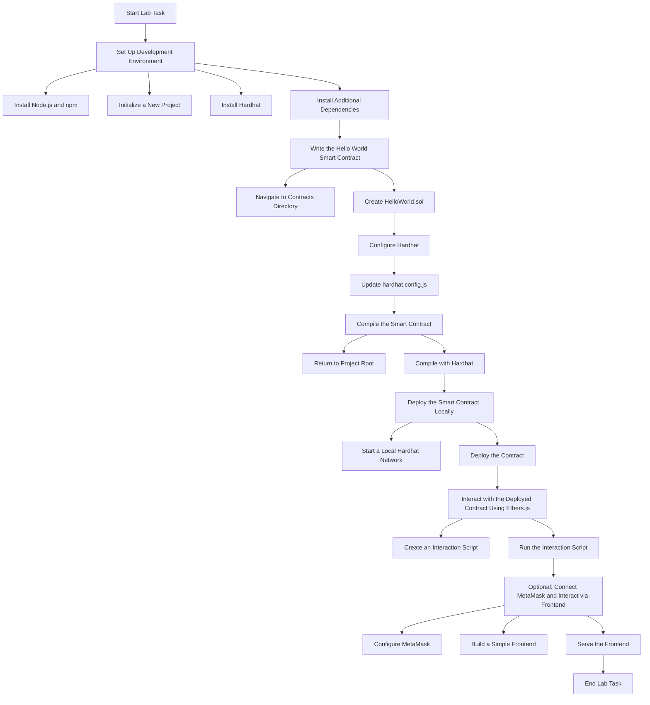

## **Lab Task: Create and Deploy a Simple "Hello World" Smart Contract**

### **Objective:**
You learn how to:
1. Write a basic smart contract in Solidity.
2. Set up a development environment using Hardhat.
3. Compile and deploy the smart contract to a local Ethereum blockchain.
4. Interact with the deployed contract using Ethers.js and MetaMask.

### **Prerequisites:**
- Basic understanding of JavaScript and programming concepts.
- Node.js and npm installed on your machine.
- A code editor (e.g., VS Code).
- MetaMask browser extension installed.

### **Tools and Resources:**
- **Solidity:** [Solidity Documentation](https://docs.soliditylang.org/)
- **Hardhat:** [Hardhat Getting Started](https://hardhat.org/getting-started/)
- **Ethers.js:** [Ethers.js Documentation](https://docs.ethers.org/v6/)
- **MetaMask:** [MetaMask Documentation](https://docs.metamask.io/)
- **Node.js:** [Download Node.js](https://nodejs.org/)
- **Code Editor:** [VS Code](https://code.visualstudio.com/)

---

### **Step-by-Step Instructions:**

#### **1. Set Up the Development Environment**

1. **Install Node.js and npm:**
   - Download and install from [Node.js official website](https://nodejs.org/).
   - Verify installation:
     ```bash
     node -v
     npm -v
     ```

2. **Initialize a New Project:**
   - Open your terminal and create a new directory for the project:
     ```bash
     mkdir hello-world-smart-contract
     cd hello-world-smart-contract
     ```
   - Initialize a new npm project:
     ```bash
     npm init -y
     ```

3. **Install Hardhat:**
   - Install Hardhat as a development dependency:
     ```bash
     npm install --save-dev hardhat
     ```
   - Initialize Hardhat in your project:
     ```bash
     npx hardhat
     ```
   - When prompted, select "Create a basic sample project" and follow the instructions.

4. **Install Additional Dependencies:**
   - Install Ethers.js and other necessary packages:
     ```bash
     npm install --save-dev @nomiclabs/hardhat-ethers ethers
     ```

#### **2. Write the "Hello World" Smart Contract**

1. **Navigate to the Contracts Directory:**
   ```bash
   cd contracts
   ```

2. **Create `HelloWorld.sol`:**
   - Delete the sample `Greeter.sol` and create a new file named `HelloWorld.sol`.
   - Add the following Solidity code:
     ```solidity
     // SPDX-License-Identifier: MIT
     pragma solidity ^0.8.0;

     contract HelloWorld {
         string public message;

         constructor(string memory _message) {
             message = _message;
         }

         function setMessage(string memory _newMessage) public {
             message = _newMessage;
         }
     }
     ```

#### **3. Configure Hardhat**

1. **Update `hardhat.config.js`:**
   - Ensure that `hardhat.config.js` includes the Ethers plugin:
     ```javascript
     require("@nomiclabs/hardhat-ethers");

     module.exports = {
       solidity: "0.8.0",
     };
     ```

#### **4. Compile the Smart Contract**

1. **Return to Project Root:**
   ```bash
   cd ..
   ```

2. **Compile:**
   ```bash
   npx hardhat compile
   ```
   - Ensure there are no compilation errors.

#### **5. Deploy the Smart Contract Locally**

1. **Start a Local Hardhat Network:**
   - In the terminal, run:
     ```bash
     npx hardhat node
     ```
   - This command starts a local Ethereum network and provides accounts with private keys for testing.

2. **Deploy the Contract:**
   - Open a new terminal window/tab in the same project directory.
   - Create a deployment script named `deploy.js` inside the `scripts` folder:
     ```javascript
     // scripts/deploy.js
     const hre = require("hardhat");

     async function main() {
       const [deployer] = await hre.ethers.getSigners();

       console.log("Deploying contracts with the account:", deployer.address);
       console.log("Account balance:", (await deployer.getBalance()).toString());

       const HelloWorld = await hre.ethers.getContractFactory("HelloWorld");
       const hello = await HelloWorld.deploy("Hello, Ethereum!");

       await hello.deployed();

       console.log("HelloWorld deployed to:", hello.address);
     }

     main()
       .then(() => process.exit(0))
       .catch((error) => {
         console.error(error);
         process.exit(1);
       });
     ```
   - Deploy the contract to the local network:
     ```bash
     npx hardhat run scripts/deploy.js --network localhost
     ```
   - Note the deployed contract address from the console output.

#### **6. Interact with the Deployed Contract Using Ethers.js**

1. **Create an Interaction Script:**
   - Create a new script named `interact.js` inside the `scripts` folder:
     ```javascript
     // scripts/interact.js
     const hre = require("hardhat");

     async function main() {
       const contractAddress = "YOUR_DEPLOYED_CONTRACT_ADDRESS"; // Replace with actual address
       const HelloWorld = await hre.ethers.getContractFactory("HelloWorld");
       const hello = await HelloWorld.attach(contractAddress);

       // Read the current message
       let message = await hello.message();
       console.log("Current Message:", message);

       // Update the message
       const tx = await hello.setMessage("Hello, Blockchain!");
       await tx.wait();

       // Read the updated message
       message = await hello.message();
       console.log("Updated Message:", message);
     }

     main()
       .then(() => process.exit(0))
       .catch((error) => {
         console.error(error);
         process.exit(1);
       });
     ```
   - Replace `YOUR_DEPLOYED_CONTRACT_ADDRESS` with the actual address obtained during deployment.

2. **Run the Interaction Script:**
   ```bash
   npx hardhat run scripts/interact.js --network localhost
   ```
   - You should see the current and updated messages in the console.

#### **7. (Optional) Connect MetaMask to the Local Network and Interact via a Frontend**

1. **Configure MetaMask:**
   - Open MetaMask in your browser.
   - Add a new network:
     - **Network Name:** Localhost 8545
     - **RPC URL:** `http://127.0.0.1:8545`
     - **Chain ID:** `31337`
     - **Currency Symbol:** ETH
   - Import one of the accounts from the Hardhat node using its private key (displayed when you started the Hardhat node).

2. **Build a Simple Frontend (Optional):**
   - Create an `index.html` file in the project root with the following content:
     ```html
     <!DOCTYPE html>
     <html lang="en">
     <head>
       <meta charset="UTF-8">
       <title>Hello World DApp</title>
       <script src="https://cdn.jsdelivr.net/npm/ethers@5.7.2/dist/ethers.min.js"></script>
     </head>
     <body>
       <h1>Hello World DApp</h1>
       <p>Message: <span id="message">Loading...</span></p>
       <input type="text" id="newMessage" placeholder="New message">
       <button onclick="setMessage()">Set Message</button>

       <script>
         const contractAddress = "YOUR_DEPLOYED_CONTRACT_ADDRESS"; // Replace with actual address
         const abi = [
           "function message() view returns (string)",
           "function setMessage(string _newMessage) public"
         ];

         async function getMessage() {
           const provider = new ethers.providers.Web3Provider(window.ethereum);
           const contract = new ethers.Contract(contractAddress, abi, provider);
           const message = await contract.message();
           document.getElementById("message").innerText = message;
         }

         async function setMessage() {
           const newMessage = document.getElementById("newMessage").value;
           const provider = new ethers.providers.Web3Provider(window.ethereum);
           const signer = provider.getSigner();
           const contract = new ethers.Contract(contractAddress, abi, signer);
           const tx = await contract.setMessage(newMessage);
           await tx.wait();
           getMessage();
         }

         window.onload = () => {
           if (typeof window.ethereum !== 'undefined') {
             getMessage();
           } else {
             alert("Please install MetaMask!");
           }
         }
       </script>
     </body>
     </html>
     ```
   - Replace `YOUR_DEPLOYED_CONTRACT_ADDRESS` with your contract's address.

3. **Serve the Frontend:**
   - Install a simple HTTP server globally if you don't have one:
     ```bash
     npm install -g live-server
     ```
   - Run the server:
     ```bash
     live-server
     ```
   - This will open the `index.html` in your default browser.
   - Connect MetaMask to the frontend and interact with your smart contract through the UI.

---

### **Learning Outcomes:**

By completing this lab task, you will:

1. **Understand Smart Contracts:**
   - Learn the basics of Solidity and how smart contracts operate on the Ethereum blockchain.

2. **Set Up Development Tools:**
   - Gain experience setting up a development environment using Hardhat and installing necessary dependencies.

3. **Compile and Deploy Contracts:**
   - Learn how to compile Solidity contracts and deploy them to a local Ethereum network.

4. **Interact with Contracts Programmatically:**
   - Use Ethers.js to read from and write to smart contracts.

5. **Integrate Wallet Functionality:**
   - Understand how to connect MetaMask to a dApp for user interactions and transaction signing.

6. **Build a Simple Frontend:**
   - Create a basic user interface to interact with the deployed smart contract, bridging the backend (smart contract) with the frontend (web interface).

---

### **Extensions for Learning:**

For you who grasp the basics quickly, consider the following extensions:

1. **Deploy to a Testnet:**
   - Guide students to deploy their contracts to an Ethereum testnet like Rinkeby or Goerli using Alchemy or Infura.

2. **Implement Additional Features:**
   - Add more functions to the smart contract, such as resetting the message or adding access control.

3. **Explore OpenZeppelin:**
   - Introduce OpenZeppelin contracts for more secure and standardized contract development.

4. **Use Hardhat Plugins:**
   - Explore additional Hardhat plugins for enhanced functionality, such as testing frameworks or deployment scripts.

5. **Security Best Practices:**
   - Teach students about common smart contract vulnerabilities and how to mitigate them.



---

### **Diagram Breakdown**

1. **Set Up Development Environment**
   - **Install Node.js and npm:** Essential for managing project dependencies.
   - **Initialize a New Project:** Set up the project directory and `package.json`.
   - **Install Hardhat:** A development environment to compile, deploy, test, and debug Ethereum software.
   - **Install Additional Dependencies:** Such as Ethers.js for interacting with the Ethereum blockchain.

2. **Write the "Hello World" Smart Contract**
   - **Navigate to Contracts Directory:** Organize your smart contracts.
   - **Create `HelloWorld.sol`:** Write the Solidity code for the smart contract.

3. **Configure Hardhat**
   - **Update `hardhat.config.js`:** Integrate necessary plugins and specify Solidity version.

4. **Compile the Smart Contract**
   - **Return to Project Root:** Navigate back to the main project directory.
   - **Compile with Hardhat:** Ensure there are no syntax or compilation errors.

5. **Deploy the Smart Contract Locally**
   - **Start a Local Hardhat Network:** Simulate an Ethereum blockchain for testing.
   - **Deploy the Contract:** Use deployment scripts to deploy your smart contract to the local network.

6. **Interact with the Deployed Contract Using Ethers.js**
   - **Create an Interaction Script:** Write scripts to read and modify the smart contract's state.
   - **Run the Interaction Script:** Execute the script to interact with the deployed contract.

7. **Optional: Connect MetaMask and Interact via Frontend**
   - **Configure MetaMask:** Connect your browser wallet to the local Hardhat network.
   - **Build a Simple Frontend:** Create a user interface to interact with the smart contract.
   - **Serve the Frontend:** Launch the frontend locally to test interactions through the UI.


