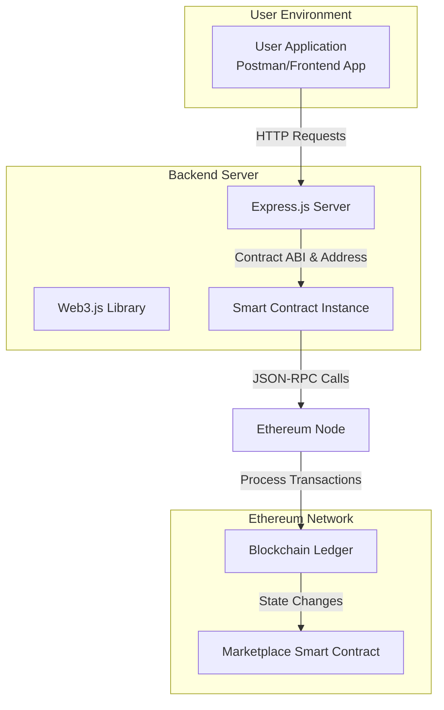

```mermaid
graph TD
    subgraph User Environment
        UserApp[User Application<br/>Postman/Frontend App]
    end

    subgraph Backend Server
        Server[Express.js Server]
        Web3[Web3.js Library]
        ContractInstance[Smart Contract Instance]
    end

    subgraph Ethereum Network
        ContractDeployed[Marketplace Smart Contract]
        BlockchainData[Blockchain Ledger]
    end

    UserApp --> |HTTP Requests| Server
    Server --> |Contract ABI & Address| ContractInstance
    ContractInstance --> |JSON-RPC Calls| EthereumNode[Ethereum Node]
    EthereumNode --> |Process Transactions| BlockchainData
    BlockchainData --> |State Changes| ContractDeployed

```
