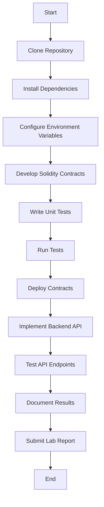

```mermaid
flowchart TD
    Start[Start]
    --> CloneRepo[Clone Repository]
    --> InstallDependencies[Install Dependencies]
    --> ConfigureEnv[Configure Environment Variables]
    --> DevelopContracts[Develop Solidity Contracts]
    --> WriteTests[Write Unit Tests]
    --> RunTests[Run Tests]
    --> DeployContracts[Deploy Contracts]
    --> ImplementAPI[Implement Backend API]
    --> TestAPI[Test API Endpoints]
    --> DocumentResults[Document Results]
    --> SubmitReport[Submit Lab Report]
    --> End[End]
```
