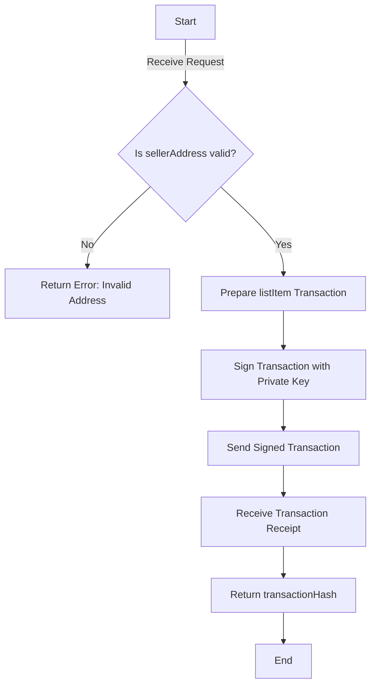

```mermaid
flowchart TD
    Start[Start]
    -->|Receive Request| CheckAddress{Is sellerAddress valid?}
    CheckAddress -->|No| ErrorInvalidAddress[Return Error: Invalid Address]
    CheckAddress -->|Yes| PrepareTransaction[Prepare listItem Transaction]
    PrepareTransaction --> SignTransaction[Sign Transaction with Private Key]
    SignTransaction --> SendTransaction[Send Signed Transaction]
    SendTransaction --> ReceiveReceipt[Receive Transaction Receipt]
    ReceiveReceipt --> ReturnResponse[Return  transactionHash ]
    ReturnResponse --> End[End]
```
