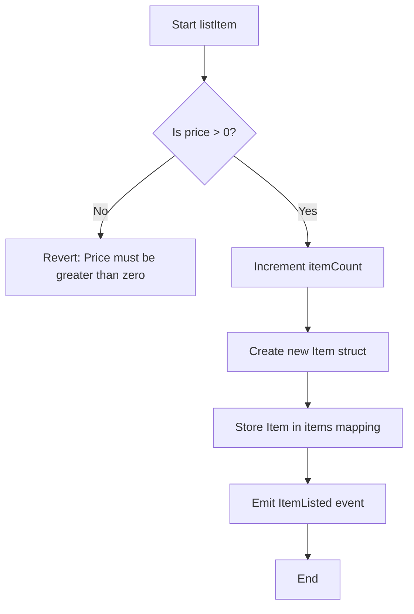

```mermaid
flowchart TD
    Start[Start listItem]
    --> CheckPrice{Is price > 0?}
    CheckPrice -->|No| ErrorInvalidPrice[Revert: Price must be greater than zero]
    CheckPrice -->|Yes| IncrementItemCount[Increment itemCount]
    IncrementItemCount --> CreateItem[Create new Item struct]
    CreateItem --> StoreItem[Store Item in items mapping]
    StoreItem --> EmitEvent[Emit ItemListed event]
    EmitEvent --> End[End]
```
