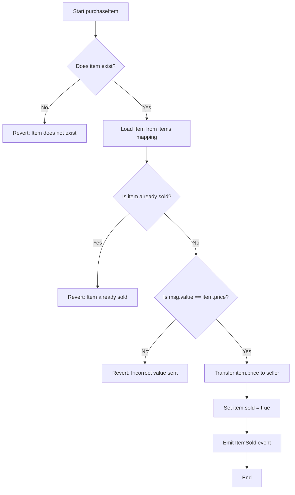

```mermaid
flowchart TD
    Start[Start purchaseItem]
    --> CheckItemExists{Does item exist?}
    CheckItemExists -->|No| ErrorItemNotFound[Revert: Item does not exist]
    CheckItemExists -->|Yes| LoadItem[Load Item from items mapping]
    LoadItem --> CheckSold{Is item already sold?}
    CheckSold -->|Yes| ErrorAlreadySold[Revert: Item already sold]
    CheckSold -->|No| CheckValue{Is msg.value == item.price?}
    CheckValue -->|No| ErrorIncorrectValue[Revert: Incorrect value sent]
    CheckValue -->|Yes| TransferFunds[Transfer item.price to seller]
    TransferFunds --> UpdateItemStatus[Set item.sold = true]
    UpdateItemStatus --> EmitEvent[Emit ItemSold event]
    EmitEvent --> End[End]
```
