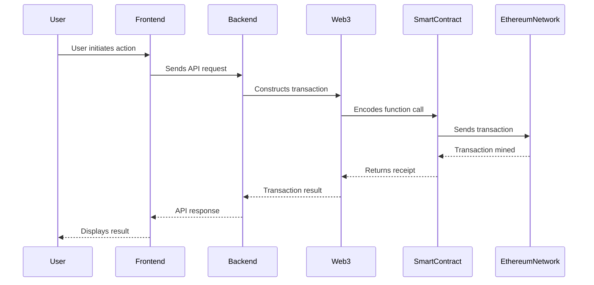

```mermaid
sequenceDiagram
    participant User
    participant Frontend
    participant Backend
    participant Web3
    participant SmartContract
    participant EthereumNetwork

    User->>Frontend: User initiates action
    Frontend->>Backend: Sends API request
    Backend->>Web3: Constructs transaction
    Web3->>SmartContract: Encodes function call
    SmartContract->>EthereumNetwork: Sends transaction
    EthereumNetwork-->>SmartContract: Transaction mined
    SmartContract-->>Web3: Returns receipt
    Web3-->>Backend: Transaction result
    Backend-->>Frontend: API response
    Frontend-->>User: Displays result
```
