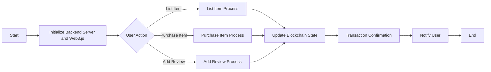

```mermaid
flowchart LR
    Start[Start]
    --> Initialize[Initialize Backend Server and Web3.js]
    --> UserAction{User Action}
    UserAction -->|List Item| ListItemProcess[List Item Process]
    UserAction -->|Purchase Item| PurchaseItemProcess[Purchase Item Process]
    UserAction -->|Add Review| AddReviewProcess[Add Review Process]
    ListItemProcess --> UpdateBlockchain[Update Blockchain State]
    PurchaseItemProcess --> UpdateBlockchain
    AddReviewProcess --> UpdateBlockchain
    UpdateBlockchain --> Confirmation[Transaction Confirmation]
    Confirmation --> NotifyUser[Notify User]
    NotifyUser --> End[End]
```
