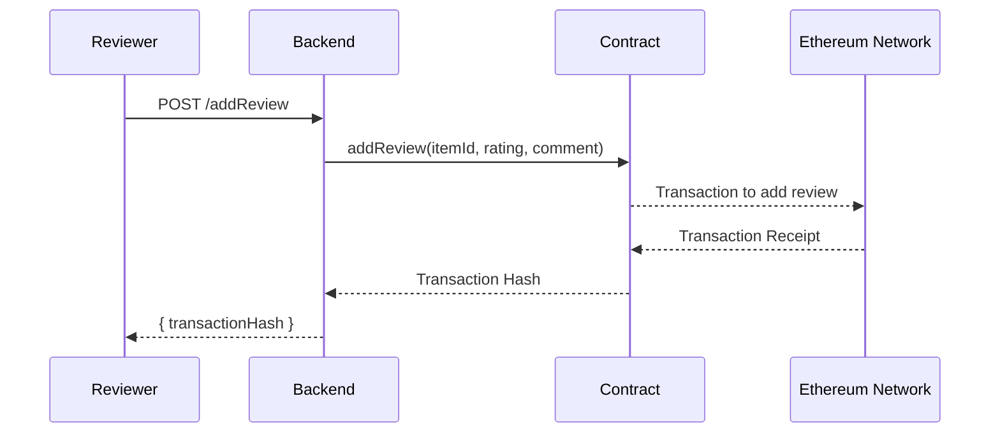

```mermaid
sequenceDiagram
    participant User as Reviewer
    participant Backend
    participant Contract
    participant Ethereum as Ethereum Network

    User->>Backend: POST /addReview
    Backend->>Contract: addReview(itemId, rating, comment)
    Contract-->>Ethereum: Transaction to add review
    Ethereum-->>Contract: Transaction Receipt
    Contract-->>Backend: Transaction Hash
    Backend-->>User: { transactionHash }
```
