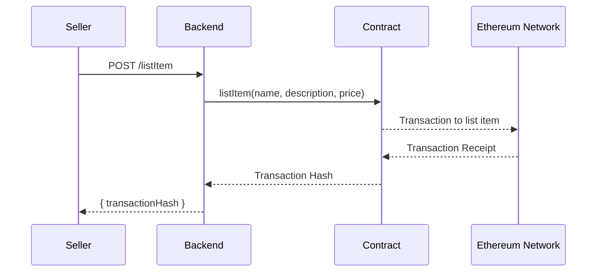

```mermaid
sequenceDiagram
    participant User as Seller
    participant Backend
    participant Contract
    participant Ethereum as Ethereum Network

    User->>Backend: POST /listItem
    Backend->>Contract: listItem(name, description, price)
    Contract-->>Ethereum: Transaction to list item
    Ethereum-->>Contract: Transaction Receipt
    Contract-->>Backend: Transaction Hash
    Backend-->>User: { transactionHash }
```
