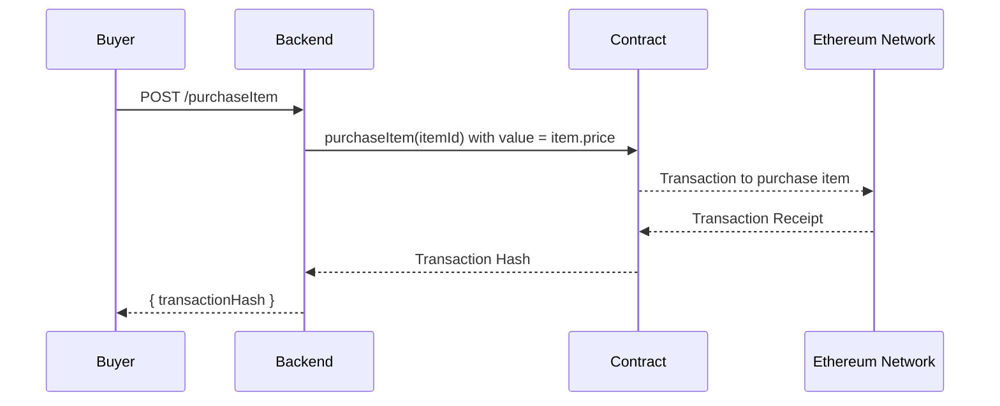

```mermaid
sequenceDiagram
    participant User as Buyer
    participant Backend
    participant Contract
    participant Ethereum as Ethereum Network

    User->>Backend: POST /purchaseItem
    Backend->>Contract: purchaseItem(itemId) with value = item.price
    Contract-->>Ethereum: Transaction to purchase item
    Ethereum-->>Contract: Transaction Receipt
    Contract-->>Backend: Transaction Hash
    Backend-->>User: { transactionHash }
```
