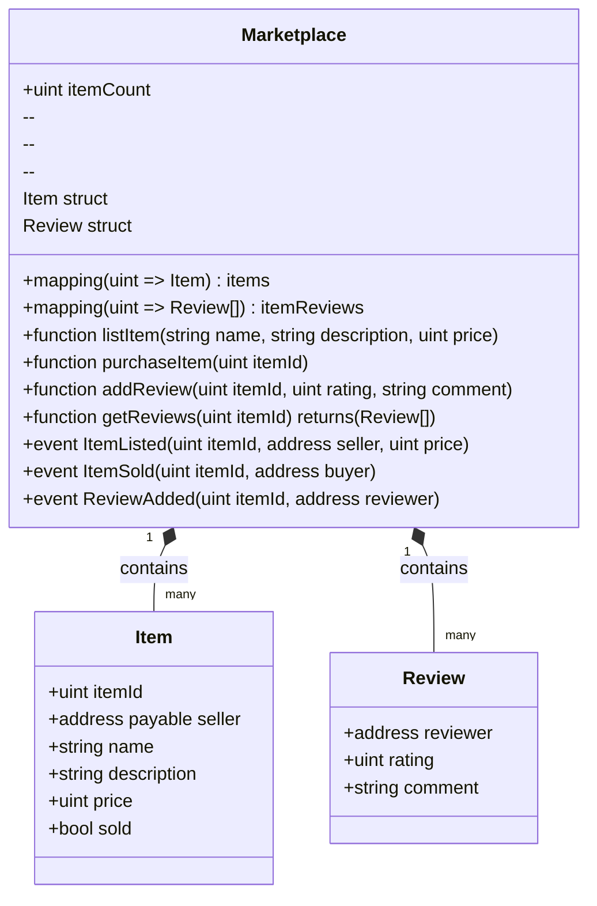

```mermaid
classDiagram
    class Marketplace {
        +uint itemCount
        +mapping(uint => Item) items
        +mapping(uint => Review[]) itemReviews
        --
        +function listItem(string name, string description, uint price)
        +function purchaseItem(uint itemId)
        +function addReview(uint itemId, uint rating, string comment)
        +function getReviews(uint itemId) returns (Review[])
        --
        +event ItemListed(uint itemId, address seller, uint price)
        +event ItemSold(uint itemId, address buyer)
        +event ReviewAdded(uint itemId, address reviewer)
        --
        Item struct
        Review struct
    }

    class Item {
        +uint itemId
        +address payable seller
        +string name
        +string description
        +uint price
        +bool sold
    }

    class Review {
        +address reviewer
        +uint rating
        +string comment
    }

    Marketplace "1" *-- "many" Item : contains
    Marketplace "1" *-- "many" Review : contains
```
