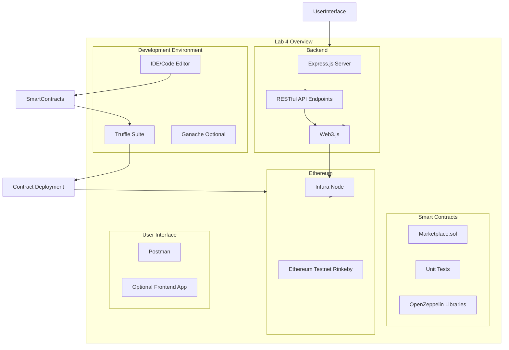

```mermaid
graph TD
    subgraph Lab 4 Overview
        subgraph Development Environment
            IDE[IDE/Code Editor]
            Truffle[Truffle Suite]
            Ganache[Ganache Optional]
        end

        subgraph Backend
            ExpressServer[Express.js Server]
            Web3js[Web3.js]
            APIEndpoints[RESTful API Endpoints]
        end

        subgraph Smart Contracts
            MarketplaceContract[Marketplace.sol]
            UnitTests[Unit Tests]
            OpenZeppelin[OpenZeppelin Libraries]
        end

        subgraph Ethereum
            Testnet[Ethereum Testnet Rinkeby]
            Infura[Infura Node]
        end

        subgraph User Interface
            Postman[Postman]
            FrontendApp[Optional Frontend App]
        end
    end

    IDE --> SmartContracts
    SmartContracts --> Truffle
    Truffle --> Deployment[Contract Deployment]
    Deployment --> Ethereum
    Backend --> Web3js
    Web3js --> Infura
    Infura --> Ethereum
    UserInterface --> Backend
    Backend --> APIEndpoints
    APIEndpoints --> Web3js

```
