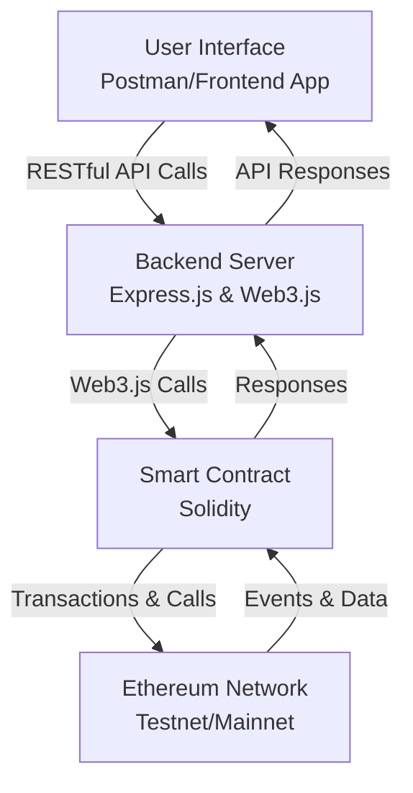

```mermaid
graph TD
    User[User Interface<br/> Postman/Frontend App]
    Backend[Backend Server<br/>Express.js & Web3.js]
    Contract[Smart Contract<br/>Solidity]
    Ethereum[Ethereum Network<br/>Testnet/Mainnet]
    User --> |RESTful API Calls| Backend
    Backend --> |Web3.js Calls| Contract
    Contract --> |Transactions & Calls| Ethereum
    Ethereum --> |Events & Data| Contract
    Contract --> |Responses| Backend
    Backend --> |API Responses| User
```
