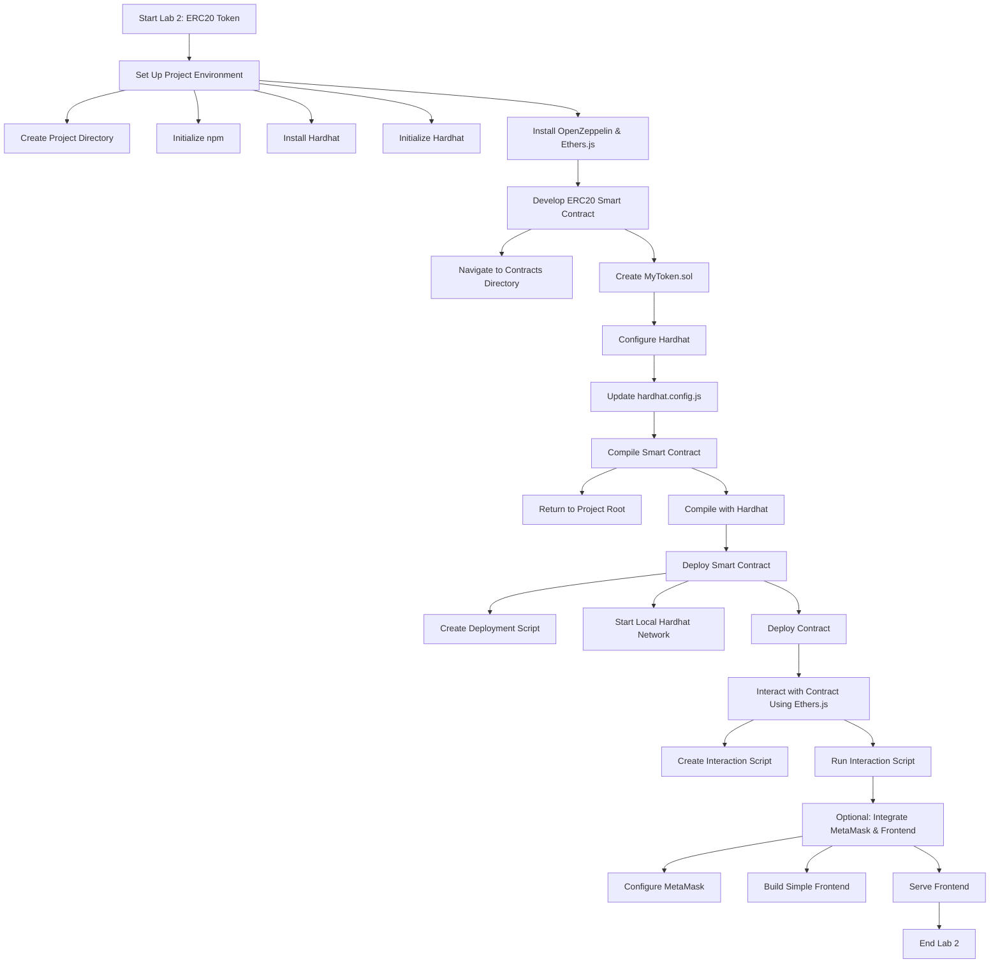

---

## **Laboratory Work 2: Develop and Deploy an ERC20 Token Smart Contract**

### **Objective:**
You will learn how to:
1. **Understand and implement the ERC20 token standard** using OpenZeppelin.
2. **Customize token parameters** such as name, symbol, and supply.
3. **Deploy the ERC20 token smart contract** to a local or test Ethereum network.
4. **Interact with the deployed token contract** using Ethers.js and MetaMask.

### **Prerequisites:**
- **Completion of Laboratory Work 1:** "Create and Deploy a Simple 'Hello World' Smart Contract".
- **Basic understanding of Solidity** and smart contract deployment.
- **Node.js and npm installed** on your machine.
- **MetaMask browser extension installed**.

### **Tools and Resources:**
- **Solidity:** [Solidity Documentation](https://docs.soliditylang.org/)
- **Hardhat:** [Hardhat Getting Started](https://hardhat.org/getting-started/)
- **Ethers.js:** [Ethers.js Documentation](https://docs.ethers.org/v6/)
- **MetaMask:** [MetaMask Documentation](https://docs.metamask.io/)
- **OpenZeppelin:** [OpenZeppelin Contracts](https://docs.openzeppelin.com/contracts)
- **Node.js:** [Download Node.js](https://nodejs.org/)
- **Code Editor:** [VS Code](https://code.visualstudio.com/)

---

### ### **Step-by-Step dev:**

#### **1. Set Up the Project Environment**

1. **Create a New Project Directory:**
   ```bash
   mkdir erc20-token
   cd erc20-token
   ```

2. **Initialize npm:**
   ```bash
   npm init -y
   ```

3. **Install Hardhat:**
   ```bash
   npm install --save-dev hardhat
   ```

4. **Initialize Hardhat:**
   ```bash
   npx hardhat
   ```
   - Select **"Create a basic sample project"**.
   - Confirm installation of necessary dependencies when prompted.

5. **Install OpenZeppelin Contracts and Ethers.js:**
   ```bash
   npm install @openzeppelin/contracts
   npm install --save-dev @nomiclabs/hardhat-ethers ethers
   ```

#### **2. Develop the ERC20 Token Smart Contract**

1. **Navigate to the Contracts Directory:**
   ```bash
   cd contracts
   ```

2. **Create `MyToken.sol`:**
   - Delete the existing `Greeter.sol` if present.
   - Create a new file named `MyToken.sol` and add the following code:

     ```solidity
     // SPDX-License-Identifier: MIT
     pragma solidity ^0.8.0;

     import "@openzeppelin/contracts/token/ERC20/ERC20.sol";

     contract MyToken is ERC20 {
         constructor(uint256 initialSupply) ERC20("MyToken", "MTK") {
             _mint(msg.sender, initialSupply * (10 ** decimals()));
         }
     }
     ```

   **Explanation:**
   - **ERC20 Import:** Utilizes OpenZeppelin's ERC20 implementation for standardized functionality.
   - **Constructor:** Sets the token name ("MyToken"), symbol ("MTK"), and mints an initial supply to the deployer's address.

#### **3. Configure Hardhat**

1. **Update `hardhat.config.js`:**
   ```javascript
   require("@nomiclabs/hardhat-ethers");

   module.exports = {
     solidity: "0.8.0",
   };
   ```

#### **4. Compile the Smart Contract**

1. **Return to Project Root:**
   ```bash
   cd ..
   ```

2. **Compile:**
   ```bash
   npx hardhat compile
   ```
   - Ensure successful compilation without errors.

#### **5. Deploy the ERC20 Token Smart Contract**

1. **Create Deployment Script:**
   - Inside the `scripts` folder, create a new file named `deployToken.js`:

     ```javascript
     // scripts/deployToken.js
     const hre = require("hardhat");

     async function main() {
       const [deployer] = await hre.ethers.getSigners();

       console.log("Deploying contracts with the account:", deployer.address);
       console.log("Account balance:", (await deployer.getBalance()).toString());

       const initialSupply = 1000000; // 1,000,000 tokens

       const MyToken = await hre.ethers.getContractFactory("MyToken");
       const token = await MyToken.deploy(initialSupply);

       await token.deployed();

       console.log("MyToken deployed to:", token.address);
     }

     main()
       .then(() => process.exit(0))
       .catch((error) => {
         console.error(error);
         process.exit(1);
       });
     ```

2. **Start a Local Hardhat Network:**
   ```bash
   npx hardhat node
   ```
   - This command starts a local Ethereum network and provides accounts with private keys for testing.
   - **Note:** Keep this terminal window open as it runs the local blockchain.

3. **Deploy the Contract:**
   - Open a new terminal window/tab in the same project directory.
   - Run the deployment script:
     ```bash
     npx hardhat run scripts/deployToken.js --network localhost
     ```
   - **Record the Deployed Contract Address:** The console will display the address where `MyToken` is deployed.

#### **6. Interact with the Deployed ERC20 Token Contract Using Ethers.js**

1. **Create Interaction Script:**
   - Inside the `scripts` folder, create a new file named `interactToken.js`:

     ```javascript
     // scripts/interactToken.js
     const hre = require("hardhat");

     async function main() {
       const contractAddress = "YOUR_DEPLOYED_CONTRACT_ADDRESS"; // Replace with actual address
       const MyToken = await hre.ethers.getContractFactory("MyToken");
       const token = await MyToken.attach(contractAddress);

       // Check initial balance of deployer
       const [deployer] = await hre.ethers.getSigners();
       const balance = await token.balanceOf(deployer.address);
       console.log(`Initial Balance of Deployer: ${hre.ethers.utils.formatUnits(balance, 18)} MTK`);

       // Transfer tokens to another account
       const recipient = "RECIPIENT_ADDRESS"; // Replace with a valid address
       const transferAmount = hre.ethers.utils.parseUnits("1000", 18); // 1,000 MTK

       const tx = await token.transfer(recipient, transferAmount);
       await tx.wait();

       // Check balances after transfer
       const deployerBalance = await token.balanceOf(deployer.address);
       const recipientBalance = await token.balanceOf(recipient);
       console.log(`Deployer Balance: ${hre.ethers.utils.formatUnits(deployerBalance, 18)} MTK`);
       console.log(`Recipient Balance: ${hre.ethers.utils.formatUnits(recipientBalance, 18)} MTK`);
     }

     main()
       .then(() => process.exit(0))
       .catch((error) => {
         console.error(error);
         process.exit(1);
       });
     ```

   **Note:**
   - **Replace `YOUR_DEPLOYED_CONTRACT_ADDRESS`** with the actual ERC20 contract address obtained during deployment.
   - **Replace `RECIPIENT_ADDRESS`** with one of the accounts provided by the Hardhat node (displayed when you started the node).

2. **Run the Interaction Script:**
   ```bash
   npx hardhat run scripts/interactToken.js --network localhost
   ```
   - **Expected Output:**
     - **Initial Balance of Deployer:** Should display `1,000,000 MTK`.
     - **Deployer Balance:** Should display `999,000 MTK` after transferring `1,000 MTK`.
     - **Recipient Balance:** Should display `1,000 MTK`.

#### **7. (Optional) Integrate MetaMask and Interact via a Frontend**

1. **Configure MetaMask for Local Network:**
   - **Open MetaMask** in your browser.
   - **Add a New Network:**
     - **Network Name:** Localhost 8545
     - **RPC URL:** `http://127.0.0.1:8545`
     - **Chain ID:** `31337`
     - **Currency Symbol:** ETH
   - **Import an Account:**
     - Use one of the private keys provided in the terminal where you ran `npx hardhat node` to import an account into MetaMask.

2. **Build a Simple Frontend:**
   - **Create an `index.html`** file in the project root with the following content:

     ```html
     <!DOCTYPE html>
     <html lang="en">
     <head>
       <meta charset="UTF-8">
       <title>ERC20 Token DApp</title>
       <script src="https://cdn.jsdelivr.net/npm/ethers@5.7.2/dist/ethers.min.js"></script>
     </head>
     <body>
       <h1>ERC20 Token DApp</h1>
       <p>Your Balance: <span id="balance">Loading...</span> MTK</p>
       <input type="text" id="recipient" placeholder="Recipient Address">
       <input type="number" id="amount" placeholder="Amount">
       <button onclick="transferTokens()">Transfer Tokens</button>

       <script>
         const contractAddress = "YOUR_DEPLOYED_CONTRACT_ADDRESS"; // Replace with actual address
         const abi = [
           "function balanceOf(address owner) view returns (uint256)",
           "function transfer(address to, uint256 amount) returns (bool)",
           "event Transfer(address indexed from, address indexed to, uint256 value)"
         ];

         async function getBalance() {
           const provider = new ethers.providers.Web3Provider(window.ethereum);
           const contract = new ethers.Contract(contractAddress, abi, provider);
           const signer = provider.getSigner();
           const address = await signer.getAddress();
           const balance = await contract.balanceOf(address);
           document.getElementById("balance").innerText = ethers.utils.formatUnits(balance, 18);
         }

         async function transferTokens() {
           const recipient = document.getElementById("recipient").value;
           const amount = document.getElementById("amount").value;
           const provider = new ethers.providers.Web3Provider(window.ethereum);
           const signer = provider.getSigner();
           const contract = new ethers.Contract(contractAddress, abi, signer);
           const tx = await contract.transfer(recipient, ethers.utils.parseUnits(amount, 18));
           await tx.wait();
           getBalance();
           alert("Transfer Successful!");
         }

         window.onload = () => {
           if (typeof window.ethereum !== 'undefined') {
             getBalance();
           } else {
             alert("Please install MetaMask!");
           }
         }
       </script>
     </body>
     </html>
     ```

   - **Instructions:**
     - **Replace `YOUR_DEPLOYED_CONTRACT_ADDRESS`** with your ERC20 contract address.

3. **Serve the Frontend:**
   - **Install a Simple HTTP Server** globally if you don't have one:
     ```bash
     npm install -g live-server
     ```
   - **Run the Server:**
     ```bash
     live-server
     ```
   - This command will open the `index.html` in your default browser.
   - **Interact with the DApp:**
     - **Check Your Balance:** The DApp will display your current MTK balance.
     - **Transfer Tokens:** Enter a recipient address and the amount of MTK to transfer, then click "Transfer Tokens".

---

### ### **Diagram for Laboratory Work 2**




---

### ### **Learning Outcomes:**

By completing this laboratory task, you will:

1. **Understand ERC20 Token Standard:**
   - Learn the structure and functionality of ERC20 tokens.
   - Appreciate the importance of standardized token interfaces for interoperability.

2. **Utilize OpenZeppelin Contracts:**
   - Leverage OpenZeppelin's secure and audited ERC20 implementations.
   - Customize token parameters such as name, symbol, and initial supply.

3. **Deploy Smart Contracts:**
   - Gain experience deploying contracts to local or test networks.
   - Understand the deployment process and associated scripts.

4. **Interact with Smart Contracts:**
   - Use Ethers.js to perform read and write operations on the blockchain.
   - Manage token balances and perform token transfers programmatically.

5. **Integrate Frontend Interfaces:**
   - Connect smart contracts with user interfaces using MetaMask and Ethers.js.
   - Enable users to interact with blockchain functionalities through web applications.

6. **Enhance Security Awareness:**
   - Recognize the significance of using audited libraries like OpenZeppelin to ensure contract security.

---


### ### **Extensions for Learning:**

For you who excel or seek additional challenges, consider the following extensions:

1. **Deploy to a Public Testnet:**
   - Guide students to deploy their ERC20 tokens to Ethereum testnets like Goerli or Rinkeby using Alchemy or Infura.

2. **Implement Additional ERC20 Features:**
   - Add functionalities such as pausing transfers, minting new tokens, or burning existing tokens.

3. **Explore Decentralized Exchanges (DEX):**
   - Integrate their ERC20 token with a DEX like Uniswap to understand token liquidity and swapping mechanisms.

4. **Introduce Governance Tokens:**
   - Modify the ERC20 token to include governance capabilities, allowing token holders to vote on proposals.

5. **Security Audits:**
   - Teach students how to perform basic security audits on their smart contracts, identifying potential vulnerabilities.

---
