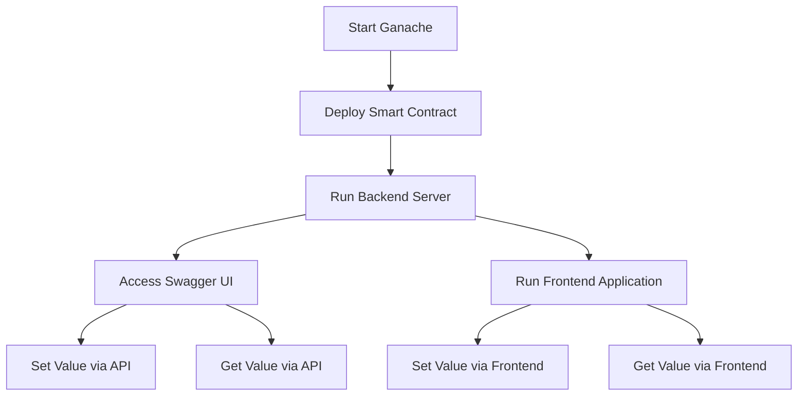
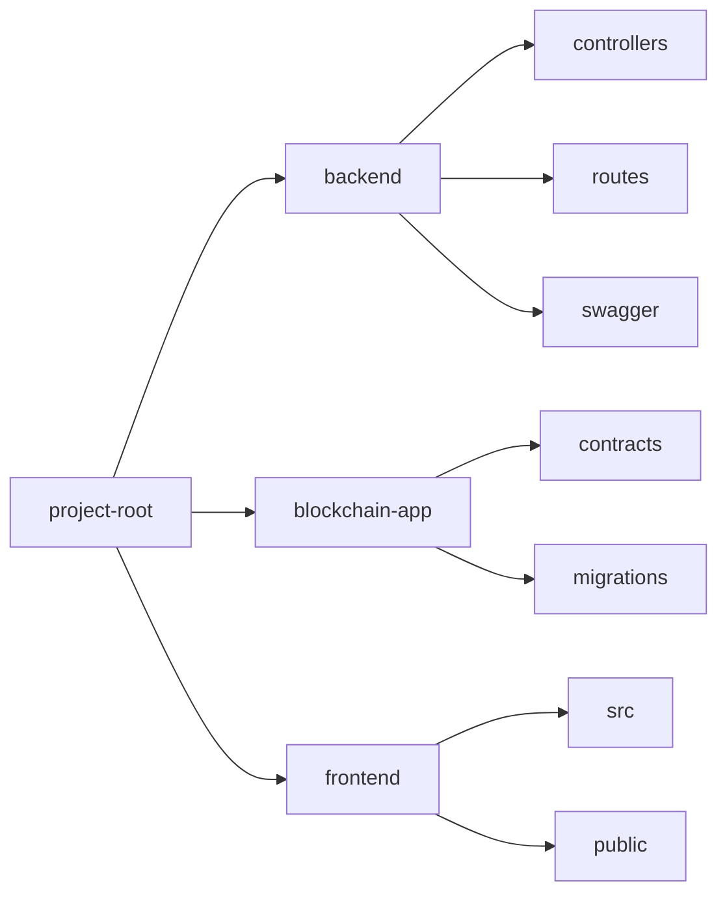

# Blockchain Backend API


## Overview

Certainly! Here's a purpose statement for this lab lecture:

---

## Purpose of the Lab Lecture

The primary goal of this lab lecture is to provide you with practical, hands-on experience in developing and interacting with blockchain technology, specifically Ethereum smart contracts. By working through this lab, you will:

- **Understand the Fundamentals of Blockchain Development**: Gain a foundational understanding of how blockchain networks operate and how smart contracts function within these networks.
  
- **Set Up a Local Development Environment**: Learn how to configure and use tools like Ganache and Truffle to create a local Ethereum blockchain environment for testing and development.
  
- **Write and Deploy Smart Contracts**: Develop proficiency in writing Solidity smart contracts, compiling them, and deploying them to a blockchain network.
  
- **Interact with Smart Contracts Programmatically**: Use Web3.js to interact with deployed smart contracts through a Node.js backend, enabling you to read from and write to the blockchain.
  
- **Create RESTful APIs for Blockchain Interaction**: Build an Express.js server that exposes API endpoints, allowing external applications to interact with the blockchain in a standardized way.
  
- **Document and Test APIs Using Swagger UI**: Implement Swagger UI for API documentation, making it easier to test and understand the endpoints you've created.
  
- **Configure and Use MetaMask**: Set up MetaMask to interact with your local blockchain network, enabling secure transaction signing and account management.
  
- **(Optional) Develop a Frontend Application**: If you choose to proceed with the frontend, you'll learn how to create a React application that interfaces with your smart contracts, providing a user-friendly way to interact with the blockchain.

### Why This Lab is Important

Blockchain technology is reshaping various industries by introducing decentralized and secure systems. This lab provides a comprehensive introduction to blockchain development by guiding you through the entire process of building a decentralized application (DApp):

- **End-to-End Development Experience**: From setting up the environment to deploying smart contracts and creating APIs, you get to experience the full lifecycle of blockchain application development.
  
- **Practical Skills Acquisition**: Hands-on activities enhance learning and retention, preparing you for real-world blockchain development challenges.
  
- **Bridging Theory and Practice**: The lab complements theoretical knowledge with practical application, solidifying your understanding of blockchain concepts.
  
- **Interdisciplinary Learning**: You'll integrate knowledge from different areas such as programming, cryptography, and network security.

The project utilizes:

- **Ganache**: Local Ethereum blockchain for development.
- **Truffle**: Framework for developing, testing, and deploying smart contracts.
- **Web3.js**: JavaScript library for interacting with the Ethereum blockchain.
- **Express.js**: Web framework for creating RESTful APIs.
- **Swagger UI**: API documentation and testing interface.
- **MetaMask**: Ethereum wallet and browser extension for managing accounts and signing transactions.

This README will guide you through the setup, execution, and interaction with the project.

## Table of Contents

- [Features](#features)
- [Prerequisites](#prerequisites)
- [Getting Started](#getting-started)
  - [Installation](#installation)
  - [Project Structure](#project-structure)
  - [Compiling and Migrating Smart Contracts](#compiling-and-migrating-smart-contracts)
  - [Running the Backend Server](#running-the-backend-server)
  - [Running the Frontend Application (Optional)](#running-the-frontend-application-optional)
- [API Documentation](#api-documentation)
  - [Testing with Swagger UI](#testing-with-swagger-ui)
- [MetaMask Configuration](#metamask-configuration)
- [Usage](#usage)
  - [Interacting via API Endpoints](#interacting-via-api-endpoints)
  - [Interacting via Frontend Application](#interacting-via-frontend-application)
- [Diagrams](#diagrams)
  - [Project Workflow](#project-workflow)
  - [Directory Structure Diagram](#directory-structure-diagram)
- [Troubleshooting](#troubleshooting)
- [Contributing](#contributing)
- [License](#license)
- [Contact](#contact)

## Features

- **Smart Contract Interaction**: Set and retrieve values using a Solidity smart contract (`SimpleStorage.sol`).
- **RESTful API**: Interact with the blockchain through HTTP endpoints using an Express.js server.
- **Local Blockchain Development**: Use Ganache to simulate a local Ethereum blockchain for development and testing.
- **API Documentation with Swagger UI**: Easily test and understand the API endpoints.
- **Frontend Application**: A React app (optional) to interact with the smart contract via a user interface.

## Prerequisites

- **Node.js** (version 14 or higher)
- **npm** (Node Package Manager)
- **Truffle Suite**
- **Ganache CLI or Ganache GUI**
- **MetaMask Browser Extension**
- **Docker** (optional, if you wish to use Docker)

## Getting Started

### Installation

1. **Clone the Repository**

   ```bash
   git clone <repository-url>
   cd <repository-directory>
   ```

2. **Install Backend Dependencies**

   ```bash
   cd backend
   npm install
   ```

3. **Install Truffle and Ganache**

   Ensure you have Truffle and Ganache installed globally:

   ```bash
   npm install -g truffle
   npm install -g ganache-cli
   ```

4. **Install Frontend Dependencies (Optional)**

   If you want to run the frontend application:

   ```bash
   cd ../frontend
   npm install
   ```

### Project Structure

Here's the detailed project structure:

```
project-root/
├── backend/
│   ├── config/
│   ├── controllers/
│   ├── db/
│   ├── routes/
│   ├── swagger/
│   ├── index.js
│   ├── package.json
│   └── swagger.js
├── blockchain-app/
│   ├── contracts/
│   │   └── SimpleStorage.sol
│   ├── migrations/
│   │   └── 2_deploy_contracts.js
│   ├── build/
│   ├── test/
│   └── truffle-config.js
├── frontend/
│   ├── src/
│   │   └── App.js
│   ├── package.json
│   └── public/
├── .env
├── .gitignore
├── docker-compose.yml
├── Dockerfile
└── README.md
```

### Compiling and Migrating Smart Contracts

1. **Start Ganache**

   In a new terminal window:

   ```bash
   ganache-cli
   ```

   or start the Ganache GUI application.

2. **Compile Contracts**

   Navigate to the `blockchain-app` directory:

   ```bash
   cd blockchain-app
   truffle compile
   ```

3. **Migrate Contracts**

   Deploy the contracts to the local blockchain network:

   ```bash
   truffle migrate --network development
   ```

   Note: Ensure the network settings in `truffle-config.js` match your Ganache setup.

4. **Update Backend Configuration**

   In `backend/index.js`, update the `contractAddress` variable with the deployed contract's address found in `blockchain-app/build/contracts/SimpleStorage.json` or from the migration output.

   ```javascript
   const contractAddress = 'YOUR_DEPLOYED_CONTRACT_ADDRESS_HERE';
   ```

### Running the Backend Server

1. **Set Environment Variables**

   Create a `.env` file in the `backend` directory (if not already present) and set any necessary environment variables.

2. **Start the Server**

   From the `backend` directory:

   ```bash
   node index.js
   ```

   The server will run on `http://localhost:3000`.

### Running the Frontend Application (Optional)

1. **Start the React App**

   From the `frontend` directory:

   ```bash
   npm start
   ```

   The app will open in your default browser at `http://localhost:3000`.

   Note: If the backend server is also running on port 3000, you may need to change the port for either the frontend or backend.

## API Documentation

### Testing with Swagger UI

1. **Access Swagger UI**

   Navigate to:

   ```
   http://localhost:3000/api-docs
   ```

   The Swagger UI will display the available API endpoints.

2. **Available Endpoints**

   - **POST `/set`**: Sets a value in the smart contract.

     - **Request Body**:

       ```json
       {
         "value": 42
       }
       ```

     - **Response**:

       - **200 OK**: Value set successfully.
       - **500 Internal Server Error**: Error message.

   - **GET `/get`**: Retrieves the current value from the smart contract.

     - **Response**:

       - **200 OK**: `{ "value": "42" }`
       - **500 Internal Server Error**: Error message.

3. **Testing Endpoints**

   Use the "Try it out" feature in Swagger UI to test the endpoints.

## MetaMask Configuration

1. **Add Ganache Network to MetaMask**

   - Open MetaMask and click on the network dropdown.
   - Select "Add Network" and enter:

     - **Network Name**: `Ganache Local`
     - **RPC URL**: `http://127.0.0.1:8545`
     - **Chain ID**: `1337` (default for Ganache CLI)
     - **Currency Symbol**: `ETH`

   - Click "Save".

2. **Import Accounts**

   - From Ganache, copy the private key of one of the accounts.
   - In MetaMask, click on the account icon and select "Import Account".
   - Paste the private key and click "Import".

3. **Interact with the DApp**

   - Ensure MetaMask is connected to the `Ganache Local` network.
   - Approve any transactions prompted by MetaMask when interacting with the smart contract.

## Usage

### Interacting via API Endpoints

- **Set a Value**

  ```bash
  curl -X POST http://localhost:3000/set \
    -H 'Content-Type: application/json' \
    -d '{"value": 42}'
  ```

- **Get the Current Value**

  ```bash
  curl http://localhost:3000/get
  ```

### Interacting via Frontend Application

- Open the app in your browser.
- Enter a value in the input field and click "Set Value" to store it in the smart contract.
- Click "Get Value" to retrieve the current stored value.

## Diagrams

### Project Workflow



### Directory Structure Diagram



## Troubleshooting

- **Server Errors**

  - Check the backend server logs for detailed error messages.
  - Ensure that the `contractAddress` in `backend/index.js` matches the deployed contract address.

- **Ganache Connection Issues**

  - Verify that Ganache is running and listening on the correct port (`8545`).
  - Ensure that the network settings in `truffle-config.js` match Ganache.

- **MetaMask Not Connecting**

  - Make sure MetaMask is connected to the `Ganache Local` network with the correct RPC URL and Chain ID.
  - Import an account from Ganache into MetaMask.

- **Port Conflicts**

  - Change the port in the backend's `index.js` or the frontend's `package.json` (`start` script) if there are conflicts.

- **Contract Deployment Issues**

  - Ensure that you have compiled the contracts before migration.
  - Delete the `build` folder in `blockchain-app` and recompile if necessary.

## Contributing

Contributions are welcome! Please open an issue or submit a pull request.

1. **Fork the Repository**

2. **Create a Feature Branch**

   ```bash
   git checkout -b feature/YourFeature
   ```

3. **Commit Your Changes**

   ```bash
   git commit -am 'Add new feature'
   ```

4. **Push to the Branch**

   ```bash
   git push origin feature/YourFeature
   ```
