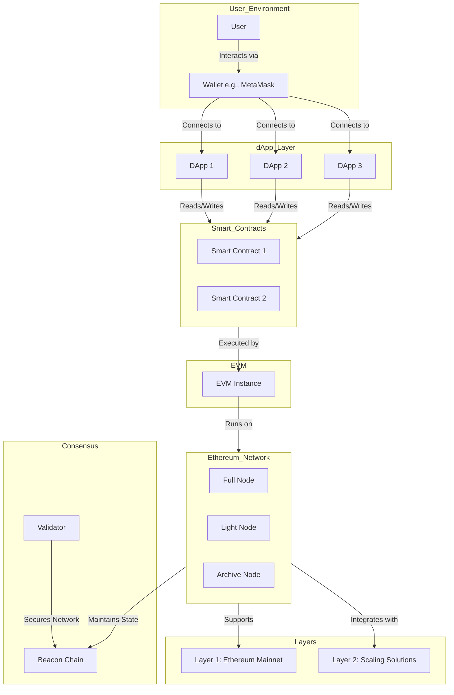

# Ethereum Architecture Overview
---

## **Ethereum Architecture Overview**

### **Table of Contents**

1. [Introduction](#introduction)
2. [Architecture Diagram](#architecture-diagram)
3. [Components and Their Roles](#components-and-their-roles)
    - [Users and Wallets](#users-and-wallets)
    - [Decentralized Applications (dApps)](#decentralized-applications-dapps)
    - [Ethereum Nodes](#ethereum-nodes)
    - [Consensus Mechanism](#consensus-mechanism)
    - [Ethereum Virtual Machine (EVM)](#ethereum-virtual-machine-evm)
    - [Smart Contracts](#smart-contracts)
    - [Layers](#layers)
    - [Interoperability and Sidechains](#interoperability-and-sidechains)
4. [Workflow Overview](#workflow-overview)
5. [Scalability and Security](#scalability-and-security)
6. [Conclusion](#conclusion)
7. [Additional Resources](#additional-resources)

---

### **Introduction**

**Ethereum** is a decentralized, open-source blockchain system that features smart contract functionality. Ether (ETH) is its native cryptocurrency. Ethereum enables developers to build and deploy decentralized applications (dApps) without intermediaries, fostering innovation in areas like decentralized finance (DeFi), non-fungible tokens (NFTs), gaming, and more.

---

### **Architecture Diagram**

Below is a **Mermaid** diagram illustrating the core components and interactions within the Ethereum ecosystem. You can visualize this diagram using any [Mermaid Live Editor](https://mermaid.live/) or integrate it into your documentation tools that support Mermaid.

[Graph link](https://mermaid.live/view#pako:eNqVVE1vozAQ_SuWz2lXkBuHlbpNVqrU9LDstgcTIRemwSrYyB6nG5X-9zU2-WIjuosU8Lx5b54ZD3mnhSqBJnSjeVuRn4tMEncZ-xyAXwZ0vpRboZVsQGJI91efYf1tfcSeeF0DsvAgcL25npEVIF9x8zrQQJaZHJmUN22b3_Md6GOpHovYwt1JtD6H4wDHI3ge4PmE0RIr0GCb_AHwTenXY4EH14WIfbd17Zfr80zM7sWmwkupObvRRSW2cJq85H2rpAFprDnqH3ktSo5Ks8PqpPo34IWS-W3FhWQhID6YMEkbrjF3Vqh5gSdWeyhinnKIz5q7B-MxKZ7q6ePqWMEF-Z00yGUBzAVkH0wU8Ad_slUfR8w_SJQcDo2s3LtLwPWIGg_UOCFp4fooNyRVtUXhGv63bT-x5Orqa3cnEXyTyFbwbhjdwBnmt2e5FkjoSai6MJOfU-LPKfP9dnxJz_kBvDRfnrRAMN3lg_TF_4c8_xdyoI9gL1z-hsIilOR5150dbZCcIsHISkOU7C58Z4NihHtVf6zofoakyBG6s8EPusPn4QWp25UGQ4YiY8GEVWrbVml0XQhDNkHtx8PNp2sZeRNYDYqYzmgDuuGidP-Z770-o07eQEYTtyzhhdsaM5rJD0flFlW6kwVNUFuYUa3spqLJC6-Ni2zr3gkWgjufZkA__gD1edUH)

---

### **Components and Their Roles**

#### 1. **Users and Wallets**

- **User:**
  - **Description:** Individuals interacting with the Ethereum network.
  - **Role:** Initiate transactions, deploy smart contracts, and interact with dApps.

- **Wallet (e.g., MetaMask):**
  - **Description:** Software applications that allow users to manage their private keys and interact with the Ethereum blockchain.
  - **Role:** Enable users to send and receive ETH, manage token holdings, and interact securely with dApps.

#### 2. **Decentralized Applications (dApps)**

- **dApp1, dApp2, dApp3:**
  - **Description:** Frontend applications built on Ethereum that provide various services like DeFi platforms, NFT marketplaces, games, etc.
  - **Role:** Offer users functionalities by interacting with smart contracts on the Ethereum blockchain.

#### 3. **Ethereum Nodes**

- **Full Node:**
  - **Description:** Maintains a complete copy of the blockchain, validates all transactions and blocks.
  - **Role:** Ensures the network's integrity and security by verifying all blockchain data.

- **Light Node:**
  - **Description:** Stores only block headers and relies on full nodes for transaction data.
  - **Role:** Provides a lightweight way for users to interact with the blockchain without the resource intensity of full nodes.

- **Archive Node:**
  - **Description:** Stores all historical states and data of the blockchain.
  - **Role:** Essential for services requiring comprehensive blockchain data, such as block explorers and analytics platforms.

#### 4. **Consensus Mechanism**

- **Validator:**
  - **Description:** Entities that propose and attest to new blocks in the blockchain.
  - **Role:** Secure the network by participating in the Proof of Stake (PoS) consensus mechanism.

- **Beacon Chain:**
  - **Description:** The core of Ethereum's PoS system, coordinating validators and managing consensus.
  - **Role:** Oversees the staking process, validator assignments, and block finality.

#### 5. **Ethereum Virtual Machine (EVM)**

- **EVM Instance:**
  - **Description:** The runtime environment for executing smart contracts on Ethereum.
  - **Role:** Processes and executes smart contract code, ensuring deterministic and isolated execution.

#### 6. **Smart Contracts**

- **Smart Contract 1, Smart Contract 2:**
  - **Description:** Self-executing contracts with the terms directly written into code.
  - **Role:** Automate agreements, manage tokens, facilitate DeFi operations, and more without intermediaries.

#### 7. **Layers**

- **Layer 1: Ethereum Mainnet:**
  - **Description:** The primary Ethereum blockchain where all transactions and smart contracts reside.
  - **Role:** Serves as the foundational layer for security, decentralization, and consensus.

- **Layer 2: Scaling Solutions:**
  - **Description:** Off-chain solutions like Rollups, State Channels, and Sidechains designed to enhance Ethereum's scalability.
  - **Role:** Reduce transaction costs and increase throughput by handling transactions off the main chain while leveraging Layer 1's security.

#### 8. **Interoperability and Sidechains** (Additional Component)

- **Sidechains:**
  - **Description:** Independent blockchains connected to Ethereum, enabling asset transfers and interoperability.
  - **Role:** Facilitate specialized functionalities and scalability without congesting the main Ethereum network.

---

### **Workflow Overview**

1. **User Interaction:**
   - The **User** accesses a **dApp** through a web browser or mobile device.
   - **MetaMask** or another wallet is used to connect the user to the dApp.

2. **Transaction Initiation:**
   - The user performs an action on the dApp (e.g., trading tokens, minting NFTs).
   - The dApp generates a transaction request and prompts the wallet for approval.

3. **Transaction Signing:**
   - The **Wallet** securely signs the transaction using the user's private key.
   - The signed transaction is sent to the **Ethereum Network** via nodes.

4. **Transaction Processing:**
   - **Full Nodes** validate the transaction against the network's consensus rules.
   - **Validators** on the **Beacon Chain** attest to the validity of the transaction.

5. **Smart Contract Execution:**
   - If the transaction interacts with a **Smart Contract**, the **EVM** executes the contract's code.
   - The outcome of the contract execution affects the state of the blockchain (e.g., token balances).

6. **Finalization:**
   - Once validated and executed, the transaction is included in a new block.
   - The **Beacon Chain** ensures the block's finality, updating the blockchain state.

7. **Feedback to User:**
   - The dApp updates its interface to reflect the transaction's success or failure.
   - Users can view transaction details and updated balances via their wallet.

---

### **Scalability and Security**

#### **Scalability:**

- **Layer 1 Limitations:**
  - Ethereum's base layer has constraints on transaction throughput and can experience high gas fees during peak demand.

- **Layer 2 Solutions:**
  - **Rollups (Optimistic and ZK-Rollups):** Aggregate multiple transactions into a single batch, reducing on-chain data and improving scalability.
  - **State Channels:** Enable off-chain transactions between parties, with only the final state recorded on-chain.
  - **Sidechains:** Independent blockchains that handle transactions separately but remain interoperable with Ethereum.

#### **Security:**

- **Consensus Mechanism (PoS):**
  - Validators stake ETH to participate in block validation, aligning incentives with network security.
  - Slashing penalties deter malicious behavior and ensure honest participation.

- **Smart Contract Audits:**
  - Regular audits and formal verification processes enhance the security and reliability of smart contracts.

- **Decentralization:**
  - A wide distribution of nodes and validators prevents central points of failure and resists censorship.

---

### **Conclusion**

Ethereum's architecture is a sophisticated and robust system designed to support a wide array of decentralized applications and services. By leveraging components like smart contracts, the EVM, and a PoS consensus mechanism, Ethereum provides a secure and flexible platform for innovation. Layer 2 scaling solutions and interoperability features further enhance its capabilities, addressing scalability challenges and fostering a thriving ecosystem.

Understanding Ethereum's logistics—from user interactions and wallet integrations to node operations and consensus—enables developers and users to effectively engage with the blockchain, harnessing its full potential for decentralized applications.

---
