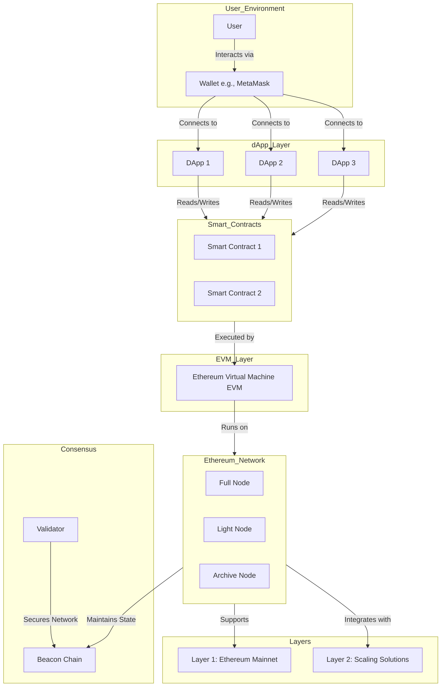

# Ethereum Network Logic and Necessities Architecture

---

## **Ethereum Network Logic and Necessities Architecture**

### **Table of Contents**

1. [Introduction](#introduction)
2. [Architecture Diagram](#architecture-diagram)
3. [Components and Their Logic](#components-and-their-logic)
    - [Users and Wallets](#users-and-wallets)
    - [Decentralized Applications (dApps)](#decentralized-applications-dapps)
    - [Ethereum Nodes](#ethereum-nodes)
    - [Consensus Mechanism](#consensus-mechanism)
    - [Ethereum Virtual Machine (EVM)](#ethereum-virtual-machine-evm)
    - [Smart Contracts](#smart-contracts)
    - [Layered Architecture](#layered-architecture)
    - [Interoperability and Sidechains](#interoperability-and-sidechains)
4. [Workflow Logic](#workflow-logic)
5. [Necessities of Each Component](#necessities-of-each-component)
6. [Scalability and Security](#scalability-and-security)
7. [Conclusion](#conclusion)
8. [Additional Resources](#additional-resources)

---

### **Introduction**

**Ethereum** is a decentralized, open-source blockchain platform that enables the creation and execution of smart contracts and decentralized applications (dApps). It serves as a foundation for a wide range of applications, from decentralized finance (DeFi) and non-fungible tokens (NFTs) to gaming and enterprise solutions. Understanding Ethereum's architecture, logic, and the necessity of its components provides valuable insights into its functionality and robustness.

---

### **Architecture Diagram**

Below is a **Mermaid** diagram illustrating the core components, their interactions, and the logical flow within the Ethereum network. You can visualize this diagram using any [Mermaid Live Editor](https://mermaid.live/) or integrate it into documentation tools that support Mermaid.

[Graph Link](https://mermaid.live/view#pako:eNqVVNtuozAQ_RXLz2lXkDceKnWbrFSp6UPZTR8gilyYBqtgI3ucblT67-sLubER3UUK2GfOmfFcnA9ayBJoQjeKtRX5OcsFsY82LwH4pUGt52LLlRQNCAxm9zhL5l6rI_bM6howCx8C15vrCVkAsgXTbz0NRJmLQZDytm3XD2wH6ujKYVE2s28Src7hOMDxAJ4GeDoSaI4VKDDN-hHwXaq3o4NHW4Uo-2Hq2i9X55Y4e-CbCi-ZptmtKiq-hVPjpdh3UmgQ2uijfslqXjKUKjusTrx_B1ZIsb6rGBdZ2BC_GUtwuRgW0kH3QiMTBWT7ApAlV2hYTRbMHl6AY424TRumcG0zQMUKPMlgD0WZpxz2Zz3bg_GQFI-E9FmcRPL7KPMfEiWHVtoMuBCAqwE17qlxQtLCVldsSCprg9y24e-wbo7J1dVNdy8QfI5ky1nXD3Tg9FPtWDYDAY6EsguT-jUl_poy3R_Hu_ScJ2Cl_vasOILuLvfBO_8f8vRfyIE-gL1w_hsKg1CSl113Nl1BcoqEQEZoIkV34fb1igHuVa6taH-apMgQurPrEHSHS-MFqT2VAk16J0PBSKjUtK1UaKsQhmyE6sbDzqctGXnnWPWKmE5oA6phvLT_pB9On1MrbyCniV2W8MpMjTnNxaelMoMy3YmCJqgMTKiSZlPR5JXV2u5Ma3OCGWc2ThMon38AVMbc_g)

---

### **Components and Their Logic**

#### 1. **Users and Wallets**

- **User:**
  - **Description:** Individuals interacting with the Ethereum network.
  - **Logic:** Users initiate transactions, deploy smart contracts, and interact with decentralized applications.
  
- **Wallet (e.g., MetaMask):**
  - **Description:** Software applications that allow users to manage their private keys and interact with the Ethereum blockchain.
  - **Logic:** Enables users to send and receive Ether (ETH), manage token holdings, and securely interact with dApps. Wallets like MetaMask act as a bridge between the user's browser or device and the Ethereum network.

#### 2. **Decentralized Applications (dApps)**

- **dApp1, dApp2, dApp3:**
  - **Description:** Frontend applications built on Ethereum that provide various services like DeFi platforms, NFT marketplaces, games, etc.
  - **Logic:** dApps interact with smart contracts on the Ethereum blockchain to offer decentralized services. They provide user interfaces for users to perform actions like trading tokens, minting NFTs, or participating in governance.

#### 3. **Ethereum Nodes**

- **Full Node:**
  - **Description:** Maintains a complete copy of the blockchain, validates all transactions and blocks.
  - **Logic:** Ensures the integrity and security of the blockchain by verifying all incoming data against consensus rules.
  
- **Light Node:**
  - **Description:** Stores only block headers and relies on full nodes for transaction data.
  - **Logic:** Provides a lightweight way for users to interact with the blockchain without the resource intensity of full nodes.
  
- **Archive Node:**
  - **Description:** Stores all historical states and data of the blockchain.
  - **Logic:** Essential for services requiring comprehensive blockchain data, such as block explorers and analytics platforms.

#### 4. **Consensus Mechanism**

- **Validator:**
  - **Description:** Entities that propose and attest to new blocks in the blockchain.
  - **Logic:** Validators stake ETH to participate in the Proof of Stake (PoS) consensus mechanism, securing the network by validating transactions and creating new blocks.
  
- **Beacon Chain:**
  - **Description:** The core of Ethereum's PoS system, coordinating validators and managing consensus.
  - **Logic:** Oversees the staking process, validator assignments, and block finality, ensuring the network remains secure and decentralized.

#### 5. **Ethereum Virtual Machine (EVM)**

- **EVM Instance:**
  - **Description:** The runtime environment for executing smart contracts on Ethereum.
  - **Logic:** Processes and executes smart contract code, ensuring deterministic and isolated execution. The EVM allows developers to write code in high-level languages like Solidity, which is then compiled to EVM bytecode.

#### 6. **Smart Contracts**

- **Smart Contract 1, Smart Contract 2:**
  - **Description:** Self-executing contracts with the terms directly written into code.
  - **Logic:** Automate agreements, manage tokens, facilitate DeFi operations, and more without intermediaries. Smart contracts interact with the EVM to perform predefined actions when certain conditions are met.

#### 7. **Layered Architecture**

- **Layer 1: Ethereum Mainnet:**
  - **Description:** The primary Ethereum blockchain where all transactions and smart contracts reside.
  - **Logic:** Serves as the foundational layer for security, decentralization, and consensus. All core operations, including smart contract deployment and transaction processing, occur here.
  
- **Layer 2: Scaling Solutions:**
  - **Description:** Off-chain solutions like Rollups, State Channels, and Sidechains designed to enhance Ethereum's scalability.
  - **Logic:** Reduce transaction costs and increase throughput by handling transactions off the main chain while leveraging Layer 1's security. Layer 2 solutions interact with Layer 1 to ensure data integrity and finality.

#### 8. **Interoperability and Sidechains**

- **Sidechains:**
  - **Description:** Independent blockchains connected to Ethereum, enabling asset transfers and interoperability.
  - **Logic:** Facilitate specialized functionalities and scalability without congesting the main Ethereum network. Sidechains can operate under different consensus mechanisms or rules tailored to specific use cases.

---

### **Workflow Logic**

1. **User Interaction:**
   - The **User** accesses a **dApp** through their **Device** (browser or mobile app).
   - The **Wallet** (e.g., MetaMask) connects the user to the dApp, enabling secure interactions.

2. **Transaction Initiation:**
   - The user performs an action on the dApp (e.g., sending ETH, minting an NFT).
   - The dApp generates a transaction request and prompts the wallet for approval.

3. **Transaction Signing:**
   - The **Wallet** securely signs the transaction using the user's private key.
   - The signed transaction is sent to the **Ethereum Network** via nodes.

4. **Transaction Processing:**
   - **Full Nodes** validate the transaction against the network's consensus rules.
   - **Validators** on the **Beacon Chain** attest to the validity of the transaction.

5. **Smart Contract Execution:**
   - If the transaction interacts with a **Smart Contract**, the **EVM** executes the contract's code.
   - The outcome of the contract execution affects the state of the blockchain (e.g., token balances).

6. **Finalization:**
   - Once validated and executed, the transaction is included in a new block.
   - The **Beacon Chain** ensures the block's finality, updating the blockchain state.

7. **Feedback to User:**
   - The dApp updates its interface to reflect the transaction's success or failure.
   - Users can view transaction details and updated balances via their wallet.

---

### **Necessities of Each Component**

#### **Users and Wallets**

- **Necessity:**
  - **User Interaction:** Users are the primary agents initiating transactions and interacting with dApps.
  - **Security:** Wallets securely manage private keys, ensuring that only authorized users can perform actions on the blockchain.
  - **Usability:** Wallets like MetaMask provide user-friendly interfaces, making blockchain interactions accessible to non-technical users.

#### **Decentralized Applications (dApps)**

- **Necessity:**
  - **Utility:** dApps offer various services like DeFi, NFTs, gaming, and more, utilizing blockchain's decentralized nature.
  - **Innovation:** They enable developers to build applications without intermediaries, fostering innovation and new business models.
  - **Interactivity:** dApps interact with smart contracts to provide dynamic and programmable functionalities.

#### **Ethereum Nodes**

- **Necessity:**
  - **Network Integrity:** Full nodes validate all transactions and blocks, ensuring the network's security and consistency.
  - **Accessibility:** Light nodes provide a resource-efficient way for users to interact with the blockchain without maintaining a full copy.
  - **Data Availability:** Archive nodes offer comprehensive blockchain data, essential for analytics, explorers, and historical queries.

#### **Consensus Mechanism**

- **Necessity:**
  - **Security:** The PoS mechanism secures the network by aligning validators' incentives with network health.
  - **Decentralization:** A diverse set of validators prevents centralization and ensures the network remains resistant to attacks.
  - **Finality:** The Beacon Chain manages block finality, ensuring that once a block is finalized, it cannot be reverted.

#### **Ethereum Virtual Machine (EVM)**

- **Necessity:**
  - **Smart Contract Execution:** The EVM provides a standardized environment for executing smart contracts, ensuring consistency across the network.
  - **Turing Completeness:** Enables developers to write complex and programmable contracts, unlocking a wide range of applications.
  - **Isolation:** The EVM executes contracts in isolation, preventing malicious code from affecting the network.

#### **Smart Contracts**

- **Necessity:**
  - **Automation:** Automate processes and agreements without the need for intermediaries.
  - **Trustlessness:** Ensure that actions are executed exactly as programmed, maintaining trust in decentralized environments.
  - **Interoperability:** Enable dApps to interact seamlessly with each other and with users, fostering a cohesive ecosystem.

#### **Layered Architecture**

- **Necessity:**
  - **Scalability:** Layer 2 solutions address Ethereum's scalability challenges by handling transactions off the main chain.
  - **Cost Efficiency:** Reduces gas fees by minimizing on-chain transactions, making the network more accessible.
  - **Flexibility:** Allows for diverse scaling solutions tailored to specific use cases without overburdening Layer 1.

#### **Interoperability and Sidechains**

- **Necessity:**
  - **Specialization:** Sidechains can be optimized for specific applications or industries, enhancing performance and functionality.
  - **Interconnectivity:** Facilitates communication between different blockchains, enabling asset transfers and data sharing.
  - **Load Distribution:** Distributes transaction loads across multiple chains, reducing congestion on the main Ethereum network.

---

### **Scalability and Security**

#### **Scalability:**

- **Challenges:**
  - **Transaction Throughput:** Ethereum's Layer 1 can handle limited transactions per second (TPS), leading to congestion and high gas fees during peak times.
  - **Resource Intensity:** Running full nodes requires significant computational resources, limiting accessibility for some users.

- **Solutions:**
  - **Layer 2 Scaling:** Implementing solutions like Rollups (Optimistic and ZK-Rollups), State Channels, and Sidechains to handle transactions off the main chain.
  - **Sharding (Future Implementation):** Dividing the blockchain into smaller, more manageable pieces (shards) to increase parallel transaction processing.

#### **Security:**

- **Mechanisms:**
  - **Proof of Stake (PoS):** Aligns validators' incentives with network security, making attacks economically unfeasible.
  - **Smart Contract Audits:** Regularly auditing smart contracts to identify and mitigate vulnerabilities.
  - **Decentralization:** A widespread network of nodes and validators prevents centralized control and enhances resistance to attacks.

- **Best Practices:**
  - **Continuous Monitoring:** Implementing tools and protocols to monitor network health and detect anomalies.
  - **Community Governance:** Leveraging decentralized governance models to make collective decisions on network upgrades and policies.

---

### **Conclusion**

The **Ethereum network** is a sophisticated and robust ecosystem designed to support a wide array of decentralized applications and services. Each component, from users and wallets to nodes and consensus mechanisms, plays a crucial role in maintaining the network's integrity, security, and functionality. The layered architecture and scalability solutions address the inherent challenges of blockchain technology, ensuring Ethereum remains a leading platform for innovation in the decentralized space.

Understanding the logic and necessities of Ethereum's architecture empowers developers and users to engage more effectively with the network, harnessing its full potential for creating and interacting with decentralized applications.

---
