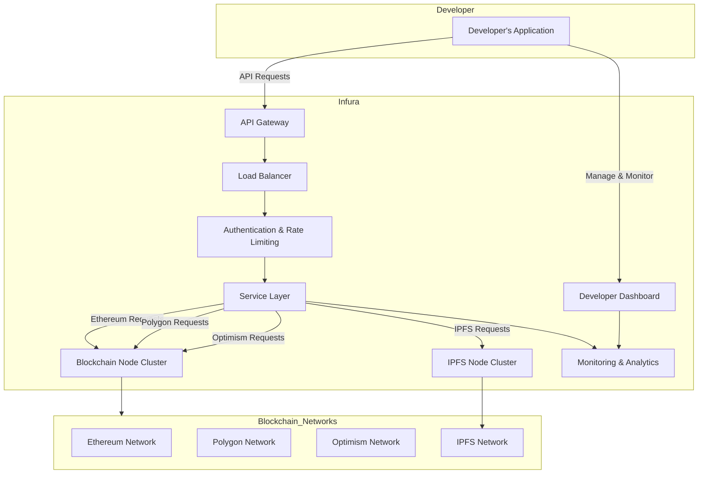

# Infura Infrastructure

### **Infura Infrastructure Diagram**

> [Graph link](https://mermaid.live/view#pako:eNqVlM9u2zAMxl9F0GG7tC-Qw4B02YYAaRc0u9nFwNqMLVSWPP1pYTR991G2HClFUqA-JCT9I01_-uBXXuka-YI3BvqW_VmVitFl_eNUWOEzSt2jmerholJxLH-1bNn3UlTghFYPE4WqLtW7QWu19wbSlOV2_QscvsBQUMhi_JCAjYb6BiSoCk0REjZnGbT0ri3CDyoXd2Bf2D0NYxvRCSdUk9E7NM-iwg0MNDImbMwy6I70-C69dcTcSF09VS0INZZZrGf0evtzN9MhvsTdaiWcNrRPkUJadalADrS6zdgV2PZRg6mTzKn2gcRp27936F60ebJp6A_SyKDvijlgkckevNVyaLQq4v8Z4nfvSFbbFXNwhgkyRC1O7mUr03ux6-tvh3Dy9_jPo3X2kFliolIe4BNDTEBeGZHghNhL0VjKz3y6lVfGLY6KpFUyE1xomjX6TM9RtM80jUqmhsxwU0M2YXzhiy7IOkcw5Oefmbn19LxuQUGDZNsIHJIvIzin78bwK96h6UDU9Kl5DWzJSfUOS76gsMY9eOlKXqo3QsE7vRtUxRfOeLziRvum5Ys9SEuZ72tyxUoAub6bkLf_FjaWUg)

### **Explanation of the Components**

1. **Developer's Application**
   - **Description:** This represents any decentralized application (dApp), wallet, exchange, NFT platform, or other blockchain-based services developed by users that need to interact with blockchain networks.

2. **API Gateway**
   - **Function:** Acts as the entry point for all API requests from the developer's application. It handles routing, protocol translation, and request aggregation.

3. **Load Balancer**
   - **Function:** Distributes incoming API requests evenly across multiple servers to ensure no single server becomes a bottleneck, enhancing performance and reliability.

4. **Authentication & Rate Limiting**
   - **Function:** Manages API key verification, user authentication, and enforces rate limits to prevent abuse and ensure fair usage among all developers.

5. **Service Layer**
   - **Function:** Processes the authenticated requests and determines which blockchain network or service (e.g., Ethereum, Polygon, IPFS) the request should be forwarded to.

6. **Blockchain Node Cluster**
   - **Function:** A scalable cluster of blockchain nodes (e.g., Ethereum, Polygon, Optimism) that handle the actual interaction with the respective blockchain networks. This includes tasks like sending transactions, querying data, and listening to events.

7. **IPFS Node Cluster**
   - **Function:** Manages interactions with the InterPlanetary File System (IPFS) for decentralized storage and retrieval of data.

8. **Monitoring & Analytics**
   - **Function:** Continuously monitors the performance, uptime, and usage metrics of the infrastructure. Provides insights and alerts for maintenance and optimization.

9. **Developer Dashboard**
   - **Function:** A user-friendly interface where developers can manage their projects, monitor API usage, view analytics, and access other management tools.

10. **Blockchain Networks**
    - **Components:**
      - **Ethereum Network:** The primary blockchain network supported by Infura for smart contracts and decentralized applications.
      - **Polygon Network:** A Layer 2 scaling solution for Ethereum, offering faster and cheaper transactions.
      - **Optimism Network:** Another Layer 2 solution for Ethereum, focusing on scalability and efficiency.
      - **IPFS Network:** A peer-to-peer network for storing and sharing data in a decentralized manner.

### **Workflow Overview**

1. **API Request Flow:**
   - The developer's application sends API requests to Infura's **API Gateway**.
   - The **Load Balancer** distributes these requests to ensure efficient handling.
   - **Authentication & Rate Limiting** verifies the request's legitimacy and ensures it adheres to usage policies.
   - The **Service Layer** processes the request, determining the appropriate blockchain network or service.
   - For blockchain interactions (e.g., Ethereum, Polygon, Optimism), the request is forwarded to the **Blockchain Node Cluster**.
   - For IPFS-related requests, it goes to the **IPFS Node Cluster**.
   - Responses are sent back through the same pathway to the developer's application.

2. **Management & Monitoring:**
   - Developers can use the **Developer Dashboard** to manage their projects and monitor usage.
   - The **Monitoring & Analytics** component ensures the infrastructure runs smoothly and provides valuable insights.
