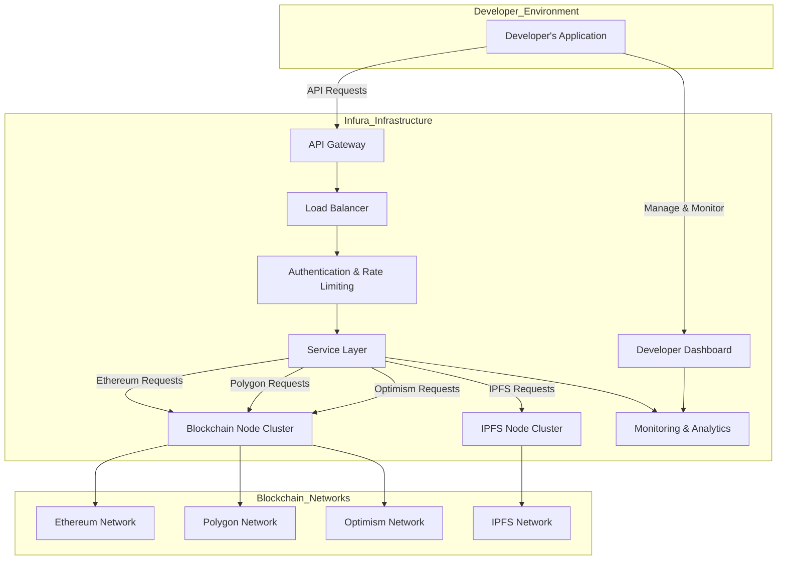

## Infura Architecture Overview

### Table of Contents

1. [Introduction](#introduction)
2. [Architecture Diagram](#architecture-diagram)
3. [Components and Participants](#components-and-participants)
    - [Developer's Application](#developers-application)
    - [API Gateway](#api-gateway)
    - [Load Balancer](#load-balancer)
    - [Authentication & Rate Limiting](#authentication--rate-limiting)
    - [Service Layer](#service-layer)
    - [Blockchain Node Cluster](#blockchain-node-cluster)
    - [IPFS Node Cluster](#ipfs-node-cluster)
    - [Monitoring & Analytics](#monitoring--analytics)
    - [Developer Dashboard](#developer-dashboard)
    - [Blockchain Networks](#blockchain-networks)
4. [Workflow Overview](#workflow-overview)
5. [Scalability and Security](#scalability-and-security)
6. [Conclusion](#conclusion)

---

### Introduction

Infura provides a robust blockchain infrastructure platform that allows developers to interact with various blockchain networks without the need to manage their own nodes. This architecture ensures scalability, reliability, and ease of use, making it a preferred choice for building decentralized applications (dApps), wallets, exchanges, NFT platforms, and more.

---

### Architecture Diagram

Below is the architecture diagram of Infura.

[Graph link](https://mermaid.live/view#pako:eNqVlM9u2zAMxl9F0GG7tC-Qw4B06YYAaRc0u9lFwNqMLdSWPP1JYTR999GWHClZMqC-mJR-pD8Rn_zOC1Uin_FKQ1ez34tcMnqMe_ELC9xjozrU23u5F1rJFqX1zPDQ9rzrsiP11TDKG1GAFUo-exBlmcuzvku5cxq29NJgrHaFdRpj3_l6-RMsvkGfUchC_ByBlYLyDhqQBepsSNiUJdDc2XqDei8KzIaYpAdl7At7op5sJVphhaySolCwgp46h4SNWQLdNap4LWoQ8pHGZ7KYs2GBfW-csScVy_WPjWeH6Br1oKSwSpOiLIYkdi6h6Um8SdgFmPpFgS7j-OPaf0YftW4f0b4p_Wpi03uakkbXZlPAApN8eK2avlIyC-8LxK_O0mBNm03BBWYYQ5jFyV4i2buL3d5-OwwueMI_Do01h8QeHoz5AJ-YwwPpyogk1ggt4sIIpDbwRLoyajqOKAo788WVwmlwn607TvOzheOYY9HRix4_6zEefzrbdSIc4jowqfXE8Zvj3pBd1ppcgX9M8AASKqTrEJhD9Htgp_SsE7_hLeoWREl_uveBzTkdsMWczygscQeusTnP5Qeh4Kza9LLgM_ox4Q3XylU1n-2gMZS5riSrLQTQbWo98vEXqNPD_Q)

---

### Components and Participants

#### 1. Developer's Application
- **Description:** Represents any decentralized application (dApp), wallet, exchange, NFT platform, or other blockchain-based services developed by users that require interaction with blockchain networks.
- **Role:** Initiates API requests to Infura to perform blockchain operations such as sending transactions, querying data, or interacting with smart contracts.

#### 2. API Gateway
- **Description:** The entry point for all incoming API requests from developers' applications.
- **Role:** Handles routing, protocol translation, and request aggregation. It ensures that requests are correctly formatted and directed to the appropriate services within Infura.

#### 3. Load Balancer
- **Description:** Distributes incoming API requests evenly across multiple servers.
- **Role:** Ensures no single server becomes a bottleneck, enhancing performance and reliability by managing traffic efficiently.

#### 4. Authentication & Rate Limiting
- **Description:** Manages security aspects such as verifying API keys and enforcing usage policies.
- **Role:** 
  - **Authentication:** Validates the legitimacy of each request using API keys or other authentication mechanisms.
  - **Rate Limiting:** Controls the number of requests a developer can make within a specific timeframe to prevent abuse and ensure fair usage.

#### 5. Service Layer
- **Description:** The core processing unit that handles authenticated requests.
- **Role:** Determines the appropriate blockchain network or service to forward the request to (e.g., Ethereum, Polygon, IPFS) and processes the request accordingly.

#### 6. Blockchain Node Cluster
- **Description:** A scalable cluster of blockchain nodes supporting various networks.
- **Role:** 
  - **Ethereum Nodes:** Handle interactions with the Ethereum network, including smart contract executions and transaction processing.
  - **Polygon Nodes:** Manage operations on the Polygon network, providing Layer 2 scaling solutions.
  - **Optimism Nodes:** Facilitate interactions with the Optimism network, offering efficient transaction processing.

#### 7. IPFS Node Cluster
- **Description:** Manages interactions with the InterPlanetary File System (IPFS).
- **Role:** Provides decentralized storage and retrieval of data, enabling applications to store and access files in a distributed manner.

#### 8. Monitoring & Analytics
- **Description:** Continuously tracks the performance, uptime, and usage metrics of Infura's infrastructure.
- **Role:** 
  - **Monitoring:** Observes system health, detects anomalies, and triggers alerts for maintenance.
  - **Analytics:** Provides insights into usage patterns, performance metrics, and operational efficiency to inform optimization strategies.

#### 9. Developer Dashboard
- **Description:** A user-friendly interface for developers to manage their projects.
- **Role:** 
  - **Project Management:** Allows developers to create and manage multiple projects.
  - **Usage Monitoring:** Displays API usage statistics, analytics, and performance metrics.
  - **Settings Management:** Enables configuration of API keys, webhooks, and other project-specific settings.

#### 10. Blockchain Networks
- **Description:** The actual decentralized networks that Infura connects to.
- **Components:**
  - **Ethereum Network:** The primary blockchain network supported by Infura for executing smart contracts and decentralized applications.
  - **Polygon Network:** A Layer 2 scaling solution for Ethereum, offering faster and cheaper transactions.
  - **Optimism Network:** Another Layer 2 solution for Ethereum, focusing on scalability and efficiency.
  - **IPFS Network:** A peer-to-peer network for storing and sharing data in a decentralized manner.

---

### Workflow Overview

1. **API Request Flow:**
    - **Initiation:** The developer's application sends an API request to Infura's **API Gateway**.
    - **Load Balancing:** The **Load Balancer** distributes the incoming request to ensure efficient handling and prevent server overload.
    - **Authentication:** The **Authentication & Rate Limiting** service verifies the request's API key and ensures it complies with usage policies.
    - **Service Processing:** The **Service Layer** processes the authenticated request, determining which blockchain network or service (Ethereum, Polygon, Optimism, IPFS) the request should be forwarded to.
    - **Node Interaction:** 
        - For blockchain interactions, the request is sent to the **Blockchain Node Cluster**, which interacts with the respective blockchain network.
        - For IPFS-related requests, it is directed to the **IPFS Node Cluster**.
    - **Response:** The response from the blockchain or IPFS network is sent back through the same pathway to the developer's application.

2. **Management & Monitoring:**
    - **Developer Dashboard:** Developers can use the **Developer Dashboard** to manage their projects, monitor API usage, view analytics, and configure settings.
    - **Monitoring & Analytics:** The **Monitoring & Analytics** component continuously observes system performance and usage, providing valuable insights and ensuring the infrastructure runs smoothly.

---

### Scalability and Security

- **Scalability:**
    - **Horizontal Scaling:** Infura's architecture is designed to scale horizontally, allowing the addition of more nodes to clusters (e.g., Blockchain Node Cluster, IPFS Node Cluster) to handle increased traffic and demand.
    - **Auto-Scaling:** Automated systems adjust resources in real-time based on current load, ensuring optimal performance during traffic spikes.

- **Security:**
    - **Data Encryption:** All data in transit is encrypted using industry-standard protocols to protect against eavesdropping and tampering.
    - **Secure Authentication:** Robust authentication mechanisms (e.g., API keys, OAuth) ensure that only authorized users can access Infura's services.
    - **Rate Limiting:** Prevents abuse and ensures fair usage by limiting the number of requests per user within a specific timeframe.
    - **Regular Audits:** Continuous security audits and monitoring help identify and mitigate potential vulnerabilities.

---

### Conclusion

Infura's architecture is meticulously designed to provide developers with seamless and scalable access to blockchain networks. By abstracting the complexities of node management and offering a suite of robust services, Infura enables the rapid development of decentralized applications and services. Understanding the roles and interactions of each component within this architecture is crucial for leveraging Infura effectively in your projects.

For further details or specific inquiries about Infura's infrastructure, feel free to reach out or consult [Infura's official documentation](https://infura.io/docs).

---