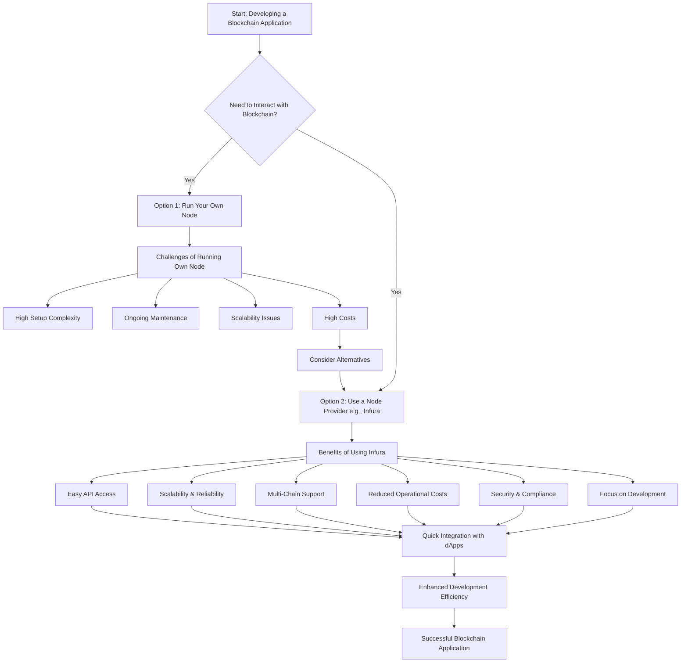

# Logic and Reasons for Using Infura

> [Graph Link](https://mermaid.live/view#pako:eNp1k81u4jAUhV_lKotZQSUo7SKLGUESCpVaOmS6qEwXHucmsWrsKLbpIMq7jxNDhTuaLKLc-LPPuT8-REwVGMVR1dKmhl_pRoJ7piQ3tDUxpLhDoRouK6AwE4q9sZpyCdOmEZxRw5V8heHwO8wOj4gFGAVLabClzMA7N_XFnh9Hf_as4z9eUH9AQlZNdwSMYlhbCS_KtrB6l_DoTL3-g6dnfBzDs0bnqOPgqVU7XmALeFVdDZx-aVt62u3fSW8xI0lNhUBZoQZVdoqyS-yLYObhEVnwqoYcjW0gUdtG4B9u9iE0JitZqe6QB5ehQUkl-3LONckZFfQ3F243LLW2qENi4pUSpY0ObKf9-pzMUGLJTW_6WXdqQY5zj41IRvUepk9LmDKGWofL48DHN1ij4KcoBK_JgxWGD5O-0bltGtWaEJmQNRaWuX6vGtfrridUBAmcwBuSI7OtV-yLyC8qdIJuyVwx67KT53HbojRBJeajHr0jPy1nb_2IVV7XT1nh5vFTeuzZU3QdRJMgugmi28vIv-_6XwuSybrzXVwahKwsOeMo2bmAi55ektz29S-t-N-VudTIvKd7kiip-zmeCneDpCN3n6Ny3zNpNIi22G4pL9yVPXRLm8jUuMVNFLvPAkvqereJNvLoUGqNyveSRbFpLQ6iVtmqjuKSCu0i2xTUYMqpq-TWI8e_JzBANg)

### **Logic and Reasons for Using Infura Diagram**

### **Explanation of the Diagram Components**

1. **Start: Developing a Blockchain Application**
   - **Description:** The journey begins with the decision to develop a decentralized application (dApp), wallet, exchange, NFT platform, or any other blockchain-based service.

2. **Need to Interact with Blockchain?**
   - **Decision Point:** Determine whether your application requires interaction with a blockchain network (e.g., Ethereum, Polygon).

3. **Option 1: Run Your Own Node**
   - **Description:** You can choose to set up and manage your own blockchain node to interact directly with the blockchain network.

4. **Challenges of Running Own Node**
   - **E1: High Setup Complexity**
     - **Issue:** Setting up a node requires technical expertise and understanding of blockchain protocols.
   - **E2: Ongoing Maintenance**
     - **Issue:** Nodes require regular updates, monitoring, and maintenance to ensure they are in sync and functioning correctly.
   - **E3: Scalability Issues**
     - **Issue:** Scaling your node infrastructure to handle increased traffic can be challenging and resource-intensive.
   - **E4: High Costs**
     - **Issue:** Running nodes involves costs related to hardware, bandwidth, storage, and electricity.

5. **Option 2: Use a Node Provider (e.g., Infura)**
   - **Description:** Instead of managing your own nodes, you can leverage a third-party node provider like Infura to handle blockchain interactions.

6. **Benefits of Using Infura**
   - **F1: Easy API Access**
     - **Advantage:** Provides straightforward APIs to interact with multiple blockchain networks without the need for in-depth node management.
   - **F2: Scalability & Reliability**
     - **Advantage:** Infura's infrastructure scales automatically to handle varying loads, ensuring high availability and uptime.
   - **F3: Multi-Chain Support**
     - **Advantage:** Supports multiple blockchain networks (e.g., Ethereum, Polygon, Optimism), enabling cross-chain functionality.
   - **F4: Reduced Operational Costs**
     - **Advantage:** Eliminates the need for investing in hardware and infrastructure, lowering overall operational expenses.
   - **F5: Security & Compliance**
     - **Advantage:** Ensures that interactions with the blockchain are secure and comply with industry standards.
   - **F6: Focus on Development**
     - **Advantage:** Allows developers to concentrate on building application features rather than managing infrastructure.

7. **Quick Integration with dApps**
   - **Description:** Infura's APIs can be rapidly integrated into your application, speeding up the development process.

8. **Enhanced Development Efficiency**
   - **Outcome:** With infrastructure management handled by Infura, development becomes more efficient and streamlined.

9. **Successful Blockchain Application**
   - **End Goal:** Achieve a robust, scalable, and reliable blockchain application without the overhead of managing blockchain nodes.

10. **Consider Alternatives**
    - **Description:** If running your own node presents too many challenges, consider switching to a node provider like Infura to overcome those obstacles.

### **Why Use Infura?**

- **Simplified Development:** By handling the complexities of node management, Infura allows developers to focus on building and deploying their applications faster.
  
- **Cost-Effective:** Avoid the significant costs associated with setting up and maintaining your own nodes, especially as your application scales.
  
- **High Reliability:** Infura offers a robust infrastructure with high uptime, ensuring your application remains accessible to users.
  
- **Scalability:** Easily handle increasing loads and traffic without worrying about infrastructure limitations.
  
- **Multi-Chain Flexibility:** Support for multiple blockchain networks enables the development of versatile and interoperable applications.
  
- **Security:** Benefit from Infura's security measures, ensuring that your application's interactions with the blockchain are secure.

