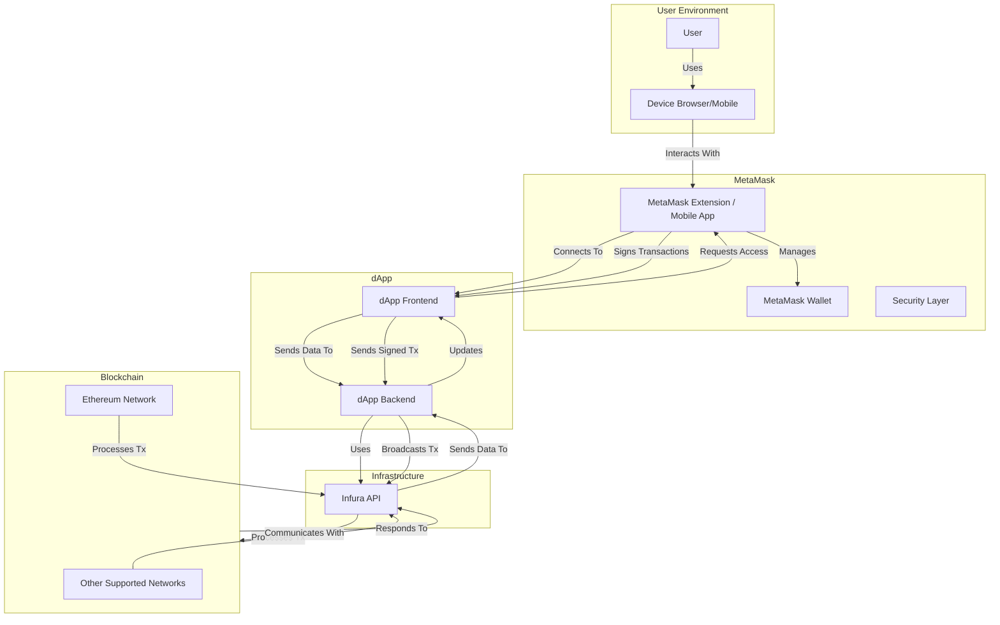

# MetaMask Purpose and Logic Architecture

---

## **MetaMask Purpose and Logic Architecture**

### **Table of Contents**

1. [Introduction](#introduction)
2. [Architecture Diagram](#architecture-diagram)
3. [Components and Their Purposes](#components-and-their-purposes)
    - [User](#user)
    - [Browser Extension / Mobile App](#browser-extension--mobile-app)
    - [MetaMask Wallet](#metamask-wallet)
    - [Decentralized Application (dApp)](#decentralized-application-dapp)
    - [Infura](#infura)
    - [Blockchain Network](#blockchain-network)
4. [Workflow Logic](#workflow-logic)
5. [Why We Need MetaMask](#why-we-need-metamask)
6. [Conclusion](#conclusion)
7. [Additional Resources](#additional-resources)

---

### **Introduction**

**MetaMask** serves as a bridge between users and the Ethereum blockchain (and other compatible networks). It provides a secure and user-friendly interface for managing digital assets, interacting with decentralized applications (dApps), and performing blockchain transactions. Understanding its purpose and logic is essential for developers and users alike to harness its full potential.

---

### **Architecture Diagram**

Below is a diagram illustrating the purpose, meaning, and logic of MetaMask within a typical dApp architecture. 

[Graph Link](https://mermaid.live/view#pako:eNqNVMlu2zAQ_RWC5wS5-1DAjlPAQN0GlYscpB4m5NgiLJEqlyRGnH_vUNQWOzGigzXLm3mjeaRfuTAS-YzvLDQl2ywLzehx4TEF_ji07E4_KWt0jdqndHxiJo8_f8fYEp-UwDy92MKaZ8rfrM2jqrCDoZaFPiFZo4c1uP3Y6O7Fo3bK6LzPjSF2w1JHNm-aCfkDVBX6sSD5E0CGIljlD3lvsB9wGOb_aDBJDGP9d9oBzSDzGB68CcECxH7Id86F7iu9teC8DcIHi2MbigcLeXqx-f3qQo9FZcRelKD0ZHm-RIuhznuD_UT_bOx-MuqvmLqNdS5vbZaFpjHWo-zR7py2PQ3X19-OZLhjJ3dKdZrH5Ir2YkF4xx6UL4-jcgk5ChnBa9Cwi82SXB9Bbo3WGNttzHFYewL2Xov7jf8COsLNhUDnzojfgTMyHFuCh7Ztp1YCds7kS5MWKdvpkiar66CVAI_9x54KMvrdjK4xkTmSftL1y6M1MhKf7uT98jK108RmQTuShKLu4g4Tdyyig7B5ucBOtxukgLjviJt-y3DuIu7emqgGnsMmZ_BTJL_iNdoalKT_qNdYV3Aqq7HgMzIlbiFUvuCFfiMoBG-ygxZ8RrcKr7g1YVfy2RYqR15o97VUQFenTpC3_zAsrM4)

---

### **Components and Their Purposes**

#### 1. **User**

- **Description:** The individual interacting with the dApp.
- **Purpose:** Initiates actions within the dApp, such as sending transactions, interacting with smart contracts, or accessing decentralized services.

#### 2. **Device (Browser/Mobile)**

- **Description:** The hardware and software platform the user employs to access the dApp.
- **Purpose:** Hosts the MetaMask extension or mobile app, facilitating user interactions with the dApp and MetaMask.

#### 3. **MetaMask Extension / Mobile App**

- **Description:** The primary interface for MetaMask on desktop browsers or mobile devices.
- **Purpose:** Acts as a gateway for users to manage their wallets, sign transactions, and interact securely with dApps.

#### 4. **MetaMask Wallet**

- **Description:** The core wallet component within MetaMask.
- **Purpose:** Stores users' private keys and manages their digital assets (e.g., ETH, ERC-20 tokens). It enables secure signing of transactions and message authentication.

#### 5. **Security Layer**

- **Description:** Security mechanisms embedded within MetaMask.
- **Purpose:** Ensures the protection of users' private keys through encryption, secure storage, and user authentication (passwords, biometrics).

#### 6. **dApp Frontend**

- **Description:** The user interface of the decentralized application.
- **Purpose:** Provides an interactive platform for users to engage with blockchain functionalities, such as viewing assets, initiating transactions, or accessing services.

#### 7. **dApp Backend**

- **Description:** The server-side logic of the dApp.
- **Purpose:** Handles data processing, interacts with blockchain networks via Infura, manages databases, and serves the frontend with necessary information.

#### 8. **Infura API**

- **Description:** Blockchain infrastructure service.
- **Purpose:** Provides reliable and scalable access to Ethereum and other blockchain networks without the need for running full nodes. It handles requests from the dApp backend to perform blockchain operations.

#### 9. **Blockchain Network**

- **Description:** Decentralized networks like Ethereum, Binance Smart Chain, Polygon, etc.
- **Purpose:** Executes smart contracts, processes transactions, and maintains the state of the blockchain.

---

### **Workflow Logic**

1. **User Interaction:**
   - The **User** accesses the dApp using their **Device** (browser or mobile app).
   - Within the browser or mobile device, the user interacts with the **MetaMask Extension/Mobile App**.

2. **Connecting to the dApp:**
   - The **dApp Frontend** requests access to the user's wallet via MetaMask.
   - **MetaMask** prompts the user to authorize the connection, ensuring secure access.

3. **Performing Actions:**
   - When the user initiates an action (e.g., sending ETH, interacting with a smart contract), the **dApp Frontend** communicates with **MetaMask**.
   - **MetaMask Wallet** handles the signing of transactions securely, ensuring that private keys remain protected.

4. **Backend Processing:**
   - The **dApp Frontend** sends the signed transaction to the **dApp Backend**.
   - The **dApp Backend** uses **Infura API** to broadcast the transaction to the **Blockchain Network**.

5. **Blockchain Interaction:**
   - The **Blockchain Network** processes the transaction, updating the state as necessary.
   - Confirmation and transaction details are sent back through **Infura API** to the **dApp Backend**.
   - The **dApp Backend** updates the **dApp Frontend**, which notifies the **User** of the transaction status.

---

### **Why We Need MetaMask**

1. **Secure Wallet Management:**
   - **Private Key Storage:** MetaMask securely stores users' private keys, encrypted on their devices, ensuring that only the user has access.
   - **Transaction Signing:** Allows users to sign transactions without exposing their private keys to dApps or external services.

2. **User Authentication:**
   - **Identity Verification:** MetaMask acts as a digital identity, enabling users to authenticate with dApps seamlessly.
   - **Permission Control:** Users can grant or revoke access to their wallets for specific dApps, enhancing security and control.

3. **Seamless Blockchain Interaction:**
   - **Web3 Integration:** Injects a Web3 instance into the browser, allowing dApps to interact with the Ethereum blockchain via MetaMask.
   - **Network Management:** Supports multiple blockchain networks, enabling users to switch between them based on their needs.

4. **Enhanced User Experience:**
   - **User-Friendly Interface:** Simplifies blockchain interactions with an intuitive UI, making it accessible even to non-technical users.
   - **Transaction Management:** Provides clear insights into transaction statuses, gas fees, and other relevant details.

5. **Decentralization and Control:**
   - **Non-Custodial:** Users retain full control over their assets without relying on third-party custodians.
   - **Open Source:** Being open-source fosters transparency and community trust, allowing for continuous security audits and improvements.

---

### **Conclusion**

**MetaMask** is an indispensable tool in the blockchain ecosystem, bridging the gap between users and decentralized applications. It ensures secure wallet management, facilitates seamless interactions with the blockchain via services like **Infura**, and enhances the overall user experience. By understanding its architecture, purpose, and logic, users and developers can better harness its capabilities to build and engage with the decentralized web effectively.

---

### **Additional Resources**

- **MetaMask:**
  - [Official Website](https://metamask.io/)
  - [MetaMask Documentation](https://docs.metamask.io/)
  - [MetaMask GitHub Repository](https://github.com/MetaMask)
  
- **Infura:**
  - [Official Website](https://infura.io/)
  - [Infura Documentation](https://infura.io/docs)
