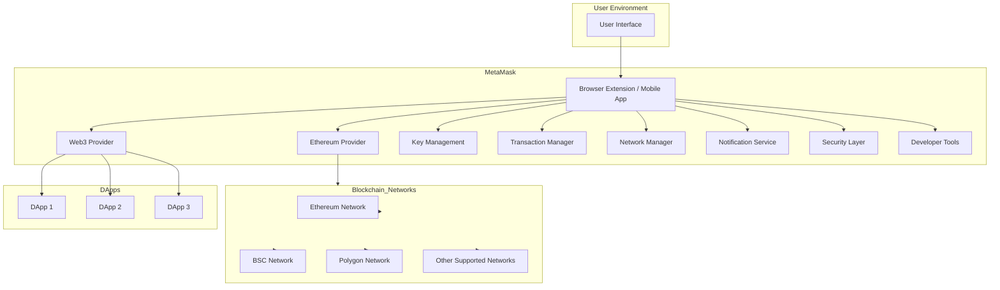

# MetaMask Architecture Overview

---

## MetaMask Architecture Overview

### Table of Contents

1. [Introduction](#introduction)
2. [Architecture Diagram](#architecture-diagram)
3. [Components and Participants](#components-and-participants)
    - [User Interface](#user-interface)
    - [Browser Extension / Mobile App](#browser-extension--mobile-app)
    - [Web3 Provider](#web3-provider)
    - [Ethereum Provider](#ethereum-provider)
    - [Blockchain Networks](#blockchain-networks)
    - [Smart Contracts and DApps](#smart-contracts-and-dapps)
    - [Security Components](#security-components)
    - [Developer Tools](#developer-tools)
4. [Workflow Overview](#workflow-overview)
5. [Scalability and Security](#scalability-and-security)
6. [Conclusion](#conclusion)

---

### Introduction

**MetaMask** is a popular cryptocurrency wallet and gateway to blockchain applications. It allows users to manage their digital assets, interact with decentralized applications (dApps), and perform transactions on various blockchain networks, primarily Ethereum. MetaMask is available as a browser extension and a mobile application, providing flexibility and ease of access for users.

---

### Architecture Diagram

Below is the architecture diagram of MetaMask using Mermaid syntax. 

[Graph link](https://mermaid.live/view#pako:eNp9lE2P2jAQhv-K5fOuqoUbh0pl4YBa2pUC6sFBlXEGsEjsaOKwjVb73-vECTgfdQ6E951nxp-TDyp0AnRBz8jzC9mtYkXsU5RHZ-wLQLJWN4laZaCMC9fPfsOa4EYZwBMXcHAxUEmsBlW2YPiWF9dH9hL1u81e_zWgCqkVaw1yd8gXstVHmQL5lueHR-ZvOM7fUN9kAshqQTrlQWtzAYQyu4OdMQV_h2rLFT9DvUBmFXlID9shVwUXxs7NxZF5Vpvj1_0J5l3jtYNbOQVqI09S8LpOBHiTApjvkdb0UiIQJUpT_eCVLd0p0kgPW8ENUp0D7rROC3aXpNGBE1umWlzFhUv1p513Md7dx662jDfyUiquBEQZR_Na12HL6HWCe9Npdbbn374niF_1IAVrXiQq81yjgaQDQ4tY2ZvjTbuWL6z-JS-Hvj1z9mxgz509H4-x35Dn56-ja-yCQ7dB_XvrMN9pkGaCgdgsEJsHhh52g0OHrlvQ_859snCvcwLcuHUCcL9tQuC4bQJ0r2MCXL9lWnC8K72NDVOjVgjjbSeEIdcU9IlmgBmXif2Cf9QZMbWBDGK6sH8TOPEyNTGN1adFeWl0VClBFwZLeKKoy_OFLk48Lawq84QbWElueydzyOc_WQgOPA)

---

### Components and Participants

#### 1. User Interface

- **Description:** The front-facing component where users interact with MetaMask.
- **Role:** Provides a user-friendly interface for managing wallets, viewing balances, sending/receiving transactions, and interacting with dApps.

#### 2. Browser Extension / Mobile App

- **Description:** The primary application through which users access MetaMask functionalities.
- **Role:**
  - **Browser Extension:** Integrates with web browsers like Chrome, Firefox, Brave, and Edge to facilitate interactions with web-based dApps.
  - **Mobile App:** Available on iOS and Android, allowing users to manage their wallets and interact with dApps on mobile devices.

#### 3. Web3 Provider

- **Description:** Acts as a bridge between the user's browser or mobile app and decentralized applications.
- **Role:** Injects a Web3 instance into the browser context, enabling dApps to communicate with the blockchain via MetaMask.

#### 4. Ethereum Provider

- **Description:** Facilitates direct communication with Ethereum and other compatible blockchain networks.
- **Role:** Handles JSON-RPC requests from dApps, enabling actions like reading blockchain data, sending transactions, and interacting with smart contracts.

#### 5. Blockchain Networks

- **Description:** The decentralized networks that MetaMask connects to.
- **Components:**
  - **Ethereum Network:** The primary network for smart contracts and dApps.
  - **Binance Smart Chain (BSC):** A popular alternative for lower transaction fees and faster confirmations.
  - **Polygon:** A Layer 2 scaling solution for Ethereum, offering improved scalability.
  - **Others:** Includes networks like Avalanche, Fantom, and custom networks configured by users.

#### 6. Smart Contracts and DApps

- **Description:** Decentralized applications and smart contracts that users interact with via MetaMask.
- **Role:** Provide various services like DeFi, NFTs, gaming, and more, which users can access securely through MetaMask.

#### 7. Key Management

- **Description:** Manages users' private keys and seed phrases.
- **Role:**
  - **Storage:** Securely stores private keys locally on the user's device.
  - **Encryption:** Encrypts keys using the user's password to prevent unauthorized access.
  - **Recovery:** Utilizes the seed phrase for wallet recovery and key regeneration.

#### 8. Transaction Manager

- **Description:** Handles the creation, signing, and broadcasting of blockchain transactions.
- **Role:**
  - **Creation:** Constructs transactions based on user actions.
  - **Signing:** Uses the user's private keys to sign transactions securely.
  - **Broadcasting:** Sends signed transactions to the appropriate blockchain network for processing.

#### 9. Network Manager

- **Description:** Manages connections to various blockchain networks.
- **Role:**
  - **Network Selection:** Allows users to switch between different networks (e.g., Ethereum Mainnet, Testnets, BSC).
  - **Configuration:** Supports adding custom networks with specific RPC endpoints and chain IDs.

#### 10. Notification Service

- **Description:** Provides real-time notifications to users about transaction statuses and other important events.
- **Role:** Alerts users about pending transactions, confirmations, errors, and other significant actions related to their wallet and dApp interactions.

#### 11. Security Layer

- **Description:** Ensures the security of user data and interactions.
- **Role:**
  - **Encryption:** Protects sensitive data through encryption.
  - **Phishing Protection:** Detects and warns users about potential phishing attempts.
  - **Permission Management:** Controls which dApps can access user data and perform actions.

#### 12. Developer Tools

- **Description:** Tools and APIs available for developers to integrate MetaMask functionalities into their dApps.
- **Role:**
  - **API Access:** Provides APIs for seamless integration with dApps.
  - **Debugging Tools:** Offers tools for developers to test and debug their applications with MetaMask integration.

---

### Workflow Overview

1. **User Interaction:**
   - The user interacts with MetaMask via the **User Interface** on their browser or mobile device.

2. **Connecting to DApps:**
   - When a user visits a dApp (e.g., DApp1, DApp2, DApp3), the **Web3 Provider** injects a Web3 instance, allowing the dApp to communicate with MetaMask.

3. **Authentication and Permissions:**
   - The dApp requests access to the user's wallet. MetaMask prompts the user to approve or deny the request, managing permissions securely.

4. **Transaction Creation:**
   - The user initiates a transaction through the dApp (e.g., sending ETH, interacting with a smart contract).
   - The **Transaction Manager** creates the transaction and prompts the user to review and confirm it.

5. **Signing and Broadcasting:**
   - Upon user approval, the **Transaction Manager** uses the **Key Management** system to sign the transaction with the user's private key.
   - The signed transaction is then **broadcasted** to the selected **Blockchain Network** via the **Ethereum Provider**.

6. **Transaction Confirmation:**
   - The **Notification Service** alerts the user about the transaction status (pending, confirmed, failed).
   - The **Blockchain Network** processes the transaction, and the status is updated accordingly.

7. **Ongoing Management:**
   - Users can manage their wallets, switch networks, view transaction history, and interact with multiple dApps through the **Developer Tools** and **Network Manager**.

---

### Scalability and Security

#### **Scalability:**

- **Network Support:** MetaMask supports multiple blockchain networks, allowing it to scale with the growing number of blockchains and dApps.
- **Performance Optimization:** Efficient handling of transactions and network requests ensures smooth performance even with high user activity.
- **Developer Tools:** Provides APIs and tools that enable developers to build scalable dApps integrated with MetaMask.

#### **Security:**

- **Private Key Security:** Users' private keys are encrypted and stored locally, ensuring that MetaMask does not have access to them.
- **Phishing Protection:** MetaMask employs mechanisms to detect and prevent phishing attacks, safeguarding user credentials.
- **Regular Audits:** The MetaMask codebase undergoes regular security audits to identify and fix vulnerabilities.
- **User Education:** MetaMask educates users on best security practices, such as safeguarding seed phrases and recognizing phishing attempts.

---

### Conclusion

MetaMask is a pivotal tool in the blockchain ecosystem, providing users with a secure and intuitive way to manage their digital assets and interact with decentralized applications. Its architecture is designed to ensure seamless connectivity between users, dApps, and various blockchain networks while prioritizing security and scalability. By understanding the components and workflow of MetaMask's infrastructure, users and developers can better leverage its capabilities to build and engage with the decentralized web.

---

### Additional Resources

- **Official Website:** [metamask.io](https://metamask.io/)
- **Documentation:** [MetaMask Docs](https://docs.metamask.io/)
- **Support Center:** [MetaMask Support](https://metamask.zendesk.com/hc/en-us)
- **GitHub Repository:** [MetaMask GitHub](https://github.com/MetaMask)
- **Security Best Practices:** [MetaMask Security Tips](https://metamask.zendesk.com/hc/en-us/articles/360015489571-Security-Best-Practices)

---
