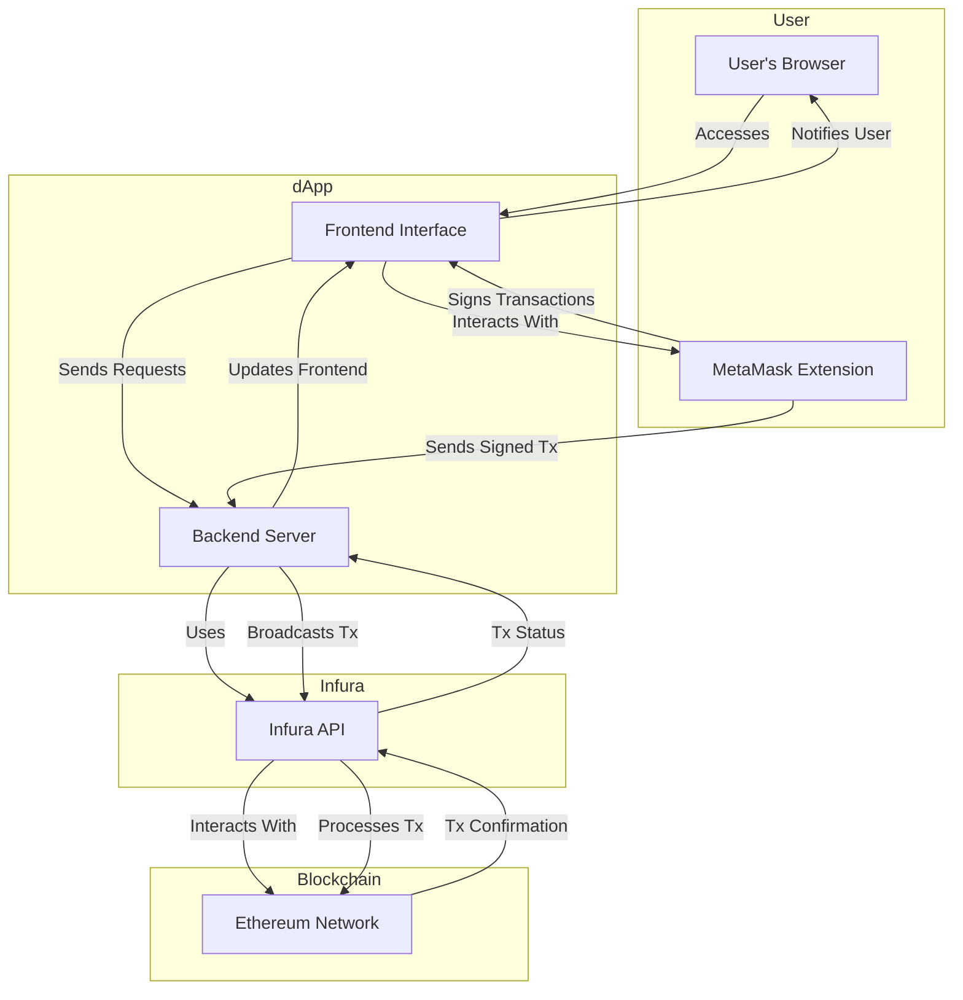

# Understanding Infura and MetaMask

---

## **Understanding Infura and MetaMask**

### **1. What is Infura?**

- **Infura** is a blockchain infrastructure provider that offers developers easy access to Ethereum and other blockchain networks without the need to run their own nodes. It provides scalable and reliable API endpoints for interacting with the blockchain, enabling developers to build decentralized applications (dApps) efficiently.

### **2. What is MetaMask?**

- **MetaMask** is a cryptocurrency wallet and gateway to blockchain applications. It allows users to manage their digital assets, interact with dApps, and sign transactions securely from their browsers or mobile devices. MetaMask acts as a bridge between users and the Ethereum blockchain (and other compatible networks).

---

## **Why Does Infura Ask MetaMask to Sign In?**

### **Misconception Clarification**

It's essential to clarify that **Infura itself does not directly interact with MetaMask**. Instead, the interaction you're experiencing likely involves a **decentralized application (dApp)** that utilizes both Infura and MetaMask to function.

### **Typical Workflow Involving Infura and MetaMask:**

1. **Developer Side:**
   - **dApp Backend:** Uses **Infura** to interact with the Ethereum blockchain. Infura provides the necessary API endpoints to send transactions, query blockchain data, and listen to events without running a full node.

2. **User Side:**
   - **User Interface:** The user accesses the dApp through a web browser.
   - **MetaMask Extension:** When the dApp requires blockchain interactions (like sending a transaction or signing a message), it prompts **MetaMask** to authenticate and authorize these actions.

### **Why MetaMask Prompts for Sign-In:**

- **Security:** MetaMask prompts users to sign in or approve actions to ensure that only authorized transactions are executed.
- **Authorization:** When a dApp requests access to the user's wallet or attempts to initiate a transaction, MetaMask requires user consent to proceed. This consent process involves signing in or approving the specific action.

### **Summary:**

- **Infura** serves as the backend infrastructure for blockchain interactions.
- **MetaMask** handles user authentication, wallet management, and transaction signing.
- **The dApp** orchestrates the interaction between Infura and MetaMask, ensuring secure and seamless user experiences.

---

## **Architecture Diagram: Infura and MetaMask Interaction via a dApp**

Below is a diagram illustrating how Infura and MetaMask interact within a typical dApp architecture. 

[Graph link](https://mermaid.live/view#pako:eNqFk8lOwzAQhl_F8oULfYEekFoWqQcQokEcEg6DPWmsNnbwQoto351x3KQtrUIunrG-Wf4Z54cLI5GP-cJCU7HsrtCMPhc-0sWrQ5uu4he9qTVrOvJoXzm2d98P0CN6eAS3zDuD3W88aqeM3lOoZaH_FJKTpjnkeLBGU4zMO4PN6LAlCDyqNAWxjND-ZHO0X30rl4rMdBksHBIkf_I8y5PFyBwIn66MWIoKlD6kuPcVWgx13hnsCf3a2OV5nqPpsdHoZjsRAp1Dt-3lJq7XHKE5GY694GdA5wnda01kJzyCr22mXlECerdF2hmC8I69KV9t-94vlP2LdrtMaL_ZtkO10I5lFrSjANrymaBTvBUUg1CybDOgiGYFUgDJbrlBac_WpGG26KmwfjMRzDbs1uhS2Rpir_-kJXruwYfBwTcSPBXuNA-u88l4VSqi42PYHj8Jfs1rpK6UpL_xJ4YWnBqvseBjMiWWEFa-4IXeEQrBm_m3FnzsbcBrbk1YVHxcwsqRF9qW7hTQu60TsvsFMVpP8w)

### **Explanation of the Diagram Components**

1. **User's Browser:**
   - The platform through which the user accesses the dApp.

2. **MetaMask Extension:**
   - Acts as the user's wallet and transaction manager within the browser.

3. **dApp Frontend:**
   - The user interface of the decentralized application, built with technologies like React, Vue, or Angular.
   - Interacts directly with MetaMask for user actions like signing in or approving transactions.

4. **dApp Backend:**
   - Handles server-side logic, such as processing data, managing databases, and interfacing with blockchain networks via Infura.

5. **Infura API:**
   - Provides the necessary endpoints for the backend to interact with the Ethereum blockchain without running a full node.

6. **Ethereum Network:**
   - The decentralized blockchain network where smart contracts and transactions are executed.

### **Workflow Steps Illustrated in the Diagram:**

1. **User Access:**
   - The user accesses the dApp through their browser.

2. **Frontend Requests:**
   - The dApp's frontend sends requests to its backend server for data or to perform actions.

3. **Backend-Infura Interaction:**
   - The backend uses Infura's API to interact with the Ethereum blockchain, such as fetching data or broadcasting transactions.

4. **MetaMask Interaction:**
   - When a user initiates an action that requires blockchain interaction (e.g., sending ETH), the frontend communicates with MetaMask.
   - MetaMask prompts the user to sign the transaction for security and authorization.

5. **Transaction Processing:**
   - Once the user approves, MetaMask signs the transaction and sends it back to the frontend.
   - The frontend forwards the signed transaction to the backend, which then broadcasts it to the Ethereum network via Infura.

6. **Transaction Confirmation:**
   - The Ethereum network processes the transaction and sends confirmation back through Infura to the backend.
   - The backend updates the frontend, which notifies the user of the transaction status.

---

## **Key Points to Understand**

1. **Indirect Connection:**
   - **Infura and MetaMask do not have a direct connection.** Their interaction is mediated through the dApp.

2. **Role Separation:**
   - **Infura:** Handles blockchain interactions at the backend, providing reliable access to the Ethereum network.
   - **MetaMask:** Manages user authentication, wallet operations, and transaction signing on the frontend.

3. **Security and Authorization:**
   - **MetaMask's Role:** Ensures that any blockchain action initiated by the dApp is authorized by the user, maintaining security and control over the user's assets.

4. **User Experience:**
   - This architecture allows users to interact with complex blockchain functionalities seamlessly, without needing to understand the underlying infrastructure.

---

## **Why You See MetaMask Sign-In Prompts When Using Infura**

Given the architecture, when you interact with a dApp that uses Infura as its backend and MetaMask as its wallet provider, the following happens:

1. **dApp Needs to Perform an Action:**
   - For example, sending a transaction, interacting with a smart contract, or accessing wallet information.

2. **dApp Requests MetaMask Authorization:**
   - To perform these actions securely, the dApp asks MetaMask to sign in or authorize the specific action.

3. **MetaMask Prompts the User:**
   - MetaMask ensures that the user is aware and consents to the action, providing a layer of security.

4. **Action Execution:**
   - Upon user approval, the action is executed using Infura's backend services to interact with the blockchain.

---

## **Conclusion**

- **Infura and MetaMask** serve distinct but complementary roles in the blockchain ecosystem.
- **Infura** provides the necessary infrastructure for blockchain interactions, while **MetaMask** manages user authentication and secure transaction signing.
- **The sign-in prompts** you experience are part of MetaMask's security measures to ensure that users authorize and control their interactions with dApps.
- **Understanding the separation of roles** helps in appreciating the security and efficiency of decentralized applications.

---

## **Additional Resources**

- **Infura:**
  - [Official Website](https://infura.io/)
  - [Infura Documentation](https://infura.io/docs)
  
- **MetaMask:**
  - [Official Website](https://metamask.io/)
  - [MetaMask Documentation](https://docs.metamask.io/)
